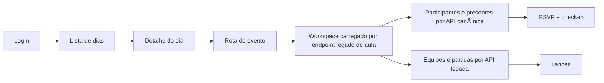
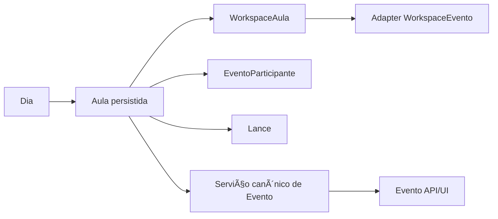

> Status: Historico / Superseded
> Substituido por: docs/current/*, docs/adr/* ou docs/plans/v0.3/*.
> Nao usar como fonte de implementacao ativa sem validar contra a documentacao viva.
# Investigação técnica do Projeto Jubileu para plan e slices executáveis

## Resumo executivo

A leitura do estado atual do Projeto Jubileu mostra uma base mais avançada do que parte da trilha documental sugere. No backend já existem `create_app()`, `/health`, aliases `/api`, autenticação JWT com modo compatível por headers, testes de fumaça, testes de eventos e testes de RBAC. No frontend já existem rota contextual de evento (`/dias/:dataIso/eventos/:eventoId`), `EventoPage`, `WorkspaceEventoPage`, polling de participantes e timeline de lances, além de uma página de sessão que permite selecionar `role` e `jogadorId`. Em outras palavras: o projeto já saiu do estágio “somente Aula”, mas ainda não concluiu a convergência arquitetural para “Evento” como conceito operacional único. fileciteturn27file0L1-L1 fileciteturn43file0L1-L1 fileciteturn46file0L1-L1 fileciteturn47file0L1-L1 fileciteturn75file0L1-L1 fileciteturn140file0L1-L1 fileciteturn142file0L1-L1 fileciteturn146file0L1-L1 fileciteturn148file0L1-L1

O ponto central do diagnóstico é este: o happy path solicitado no material anexado — autenticar, abrir dia, abrir evento, fazer RSVP/check-in, ver presentes, participar da partida e registrar lance — está **parcialmente implementado**, mas ainda com uma ponte transitória entre superfícies legadas e canônicas. O evento já existe como API canônica, porém a tela principal de evento ainda é abastecida por `useWorkspaceEvento -> useWorkspaceAula -> /dias/{dataIso}/aulas/{aulaId}/workspace`, e os painéis centrais continuam presos aos serviços legados de Aula. O resultado prático é um sistema funcional para navegação, leitura e parte dos comandos administrativos, mas ainda incompleto para o uso real do fluxo self de evento. fileciteturn0file0 fileciteturn61file0L1-L1 fileciteturn63file0L1-L1 fileciteturn65file0L1-L1 fileciteturn104file0L1-L1 fileciteturn105file0L1-L1

A melhor decisão, portanto, não é uma reescrita. É fechar a transição com um plano incremental e compatível com a taxonomia já existente em entity["company","Linear","issue tracking platform"] e no repositório em entity["company","GitHub","code hosting platform"]: congelar contratos do happy path, introduzir um adapter explícito de `WorkspaceEvento`, completar UI de RSVP/check-in/seed, endurecer o modelo de sessão operacional `user + jogador`, e só então avançar em simplificação estrutural e hardening de deploy. Essa direção é coerente com o plano incremental já documentado no repositório e com a separação CORE/DEV que já existe nas issues. fileciteturn84file0L1-L1 fileciteturn85file0L1-L1 fileciteturn86file0L1-L1 fileciteturn87file0L1-L1 fileciteturn88file0L1-L1 fileciteturn115file0L1-L1 fileciteturn115file3L1-L1 fileciteturn116file0L1-L1

## Diagnóstico do happy path

A investigação foi guiada pelo fluxo funcional explícito anexado pelo usuário: usuário autenticado, lista de dias, seleção de dia, acesso ao evento, RSVP/check-in, visualização de presentes, participação em partida e registro de lance. Isso é importante porque várias decisões no código já foram tomadas para esse caminho, mas a implementação ainda mistura contrato legado e contrato canônico. fileciteturn0file0

O fluxo observado hoje pode ser sintetizado assim:

A tabela abaixo resume o estado do happy path com base no código auditado, nos testes existentes e no material anexado. A síntese usa principalmente `AuthContext`, `UsuarioPerfil`, `DiaLista`, `DiaDetalhe`, `AppRoutes`, `EventoPage`, `WorkspaceEventoPage`, `useWorkspaceEvento`, `useEventoLiveData`, `useLancesTimeline`, `test_eventos_api.py` e `test_auth_jwt_rbac.py`. fileciteturn66file0L1-L1 fileciteturn148file0L1-L1 fileciteturn44file0L1-L1 fileciteturn45file0L1-L1 fileciteturn43file0L1-L1 fileciteturn46file0L1-L1 fileciteturn47file0L1-L1 fileciteturn61file0L1-L1 fileciteturn75file0L1-L1 fileciteturn140file0L1-L1 fileciteturn99file0L1-L1 fileciteturn146file0L1-L1

| Etapa | Estado | Evidência operacional | Diagnóstico |
|---|---|---|---|
| Autenticar | Parcialmente funcional | `/api/auth/login` e `/api/auth/me` existem; há JWT e modo compatível; `UsuarioPerfil` já permite `role` e `jogadorId` | Funciona, mas o `AuthContext` faz fallback silencioso para modo legado em qualquer erro e pode deixar a sessão sem `jogadorId` |
| Acessar lista de dias | Funcional | `DiaLista` usa `listarDias()` | Caminho estável |
| Selecionar um dia | Funcional | `DiaDetalhe` usa `obterDiaPorData()` e já abre rota de evento | Caminho estável |
| Acessar evento | Parcialmente funcional | existe `/dias/:dataIso/eventos/:eventoId`; `EventoPage` renderiza `WorkspaceEventoPage` | A rota já é canônica, mas a carga de dados ainda é de Aula |
| Fazer RSVP | Não implementado na UI | endpoints e service existem | Backend pronto, frontend ainda sem gatilho operacional |
| Fazer check-in | Não implementado na UI | endpoints e service existem | Mesmo problema do RSVP |
| Ver participantes/presentes | Funcional | `useEventoLiveData` chama `/api/eventos/{id}/participants` e `/presentes` | Leitura pronta |
| Participar de uma partida | Parcial | aula usa `/dias/.../partidas`; evento tem `seed` canônico disponível | Fluxo de partida ainda é mais forte no caminho legado |
| Registrar lance | Parcialmente funcional | hooks e componentes usam `/api/partidas/{id}/lances` e `/api/eventos/{id}/lances`; backend tem testes | O registro existe, mas depende de o evento já estar operacionalmente configurado |

Os bloqueios mais relevantes do happy path estão concentrados em três pontos. Primeiro, **as ações self de evento não estão fechadas na UI**, apesar de existirem no backend e nos serviços. Segundo, **a tela de evento ainda depende do read-model legado de Aula**. Terceiro, **a sessão operacional ainda é permissiva demais no login e rígida demais no uso do happy path**, porque o fallback para modo legado pode mascarar um backend fora do ar e, ao mesmo tempo, não garantir `jogadorId` para RSVP/check-in. fileciteturn56file0L1-L1 fileciteturn57file0L1-L1 fileciteturn61file0L1-L1 fileciteturn65file0L1-L1 fileciteturn66file0L1-L1 fileciteturn69file0L1-L1 fileciteturn123file0L1-L1

## Mapa de drift e inventário de consumo

O drift principal não é “frontend versus backend” no sentido clássico de ausência de endpoints. O backend já oferece bastante superfície canônica. O drift real é **frontend canônico na navegação, legado na orquestração**. A rota já fala em evento; a API de participantes, lances e status já fala em evento; mas a carga do workspace, os painéis centrais e parte da lógica de capability ainda falam em Aula. fileciteturn43file0L1-L1 fileciteturn47file0L1-L1 fileciteturn61file0L1-L1 fileciteturn63file0L1-L1 fileciteturn65file0L1-L1 fileciteturn125file0L1-L1

A tabela abaixo consolida as principais telas e os endpoints efetivamente consumidos hoje. A síntese foi derivada de `AppRoutes.tsx`, `diasService.ts`, `WorkspaceEquipesPanel.tsx`, `WorkspacePartidasPanel.tsx`, `useEventoLiveData.ts`, `EventoStatusActions.tsx`, `useLancesTimeline.ts`, `authService.ts`, `AuthContext.tsx`, `UsuarioPerfil.tsx` e `jogadoresDashboardService.ts`. fileciteturn43file0L1-L1 fileciteturn73file0L1-L1 fileciteturn104file0L1-L1 fileciteturn105file0L1-L1 fileciteturn75file0L1-L1 fileciteturn128file0L1-L1 fileciteturn140file0L1-L1 fileciteturn69file0L1-L1 fileciteturn66file0L1-L1 fileciteturn148file0L1-L1 fileciteturn113file0L1-L1

| Tela / container | Endpoint(s) consumidos hoje | Consumo atual | Leitura |
|---|---|---|---|
| `DiaLista` | `GET /dias` | Ativo | Correto |
| `DiaDetalhe` | `GET /dias/{dataIso}`, `GET /turmas/`, `POST /dias/{dataIso}/aulas`, `DELETE /dias/{dataIso}/aulas/{id}` | Ativo | Legado, mas funcional |
| `EventoPage` / `WorkspaceEventoPage` | `GET /dias/{dataIso}/aulas/{aulaId}/workspace` | Ativo | Façade canônica sobre endpoint legado |
| `WorkspaceEquipesPanel` | `PUT /dias/.../jogadores/{id}/status`, `PUT /dias/.../jogadores/{id}/time`, `POST /dias/.../times`, `DELETE /dias/.../times/{id}`, `PUT /dias/.../estado-equipes`, `POST /dias/.../start`, `POST /dias/.../finish` | Ativo | Núcleo de Aula persistida |
| `WorkspacePartidasPanel` | `POST /dias/.../partidas`, `DELETE /dias/.../partidas/{id}`, `PUT /dias/.../partidas/{id}/jogadores/{id}/stats` | Ativo | Núcleo de Aula persistida |
| `useEventoLiveData` / `ParticipantesPanel` | `GET /api/eventos/{id}/participants`, `GET /api/eventos/{id}/presentes` | Ativo | Canônico, leitura pronta |
| `EventoStatusActions` | `POST /api/eventos/{id}/start`, `POST /api/eventos/{id}/end`, `POST /api/eventos/{id}/cancel` | Ativo | Canônico, mas com gating por status legado |
| `useLancesTimeline` / `QuickAddLance` | `GET /api/eventos/{id}/lances`, `POST /api/partidas/{id}/lances` | Ativo | Canônico e já com polling |
| `AuthContext` / `UsuarioPerfil` | `POST /api/auth/login`, `GET /api/auth/me`, `GET /jogadores/` | Ativo | Bom ponto de apoio para fechar self-actions |
| `DashboardJogadores` | `GET /dashboards/jogadores/resumo`, `GET /dashboards/jogadores/ranking` | Ativo no frontend, mas suspeito | O backend testado garante `/api/dashboards/*`, não o contrato root |

O segundo recorte útil é identificar superfície pronta no backend que ainda não virou experiência de produto. Os serviços de evento exportam RSVP, cancelamento de RSVP, check-in self, desfazer check-in, check-in manual de participante e `seedPartidaEvento`, mas as buscas no repositório retornam apenas as definições desses métodos e não revelam call sites equivalentes na UI; por contraste, `EventoStatusActions` e a timeline de lances aparecem de fato como consumo real. fileciteturn56file0L1-L1 fileciteturn135file0L1-L1 fileciteturn141file0L1-L1 fileciteturn131file0L1-L1 fileciteturn138file0L1-L1 fileciteturn136file2L1-L1 fileciteturn140file0L1-L1

A correção mínima para o drift atual não é trocar nomes em massa. É introduzir um **adapter explícito** entre `WorkspaceAula` e `WorkspaceEvento`, unificar o vocabulário de tipo/status na camada de apresentação e completar as ações self que já existem no backend. Isso reduz o drift sem tocar em tabelas, sem renomear persistência e sem romper o contrato legado que hoje sustenta a parte já funcional do produto. fileciteturn81file0L1-L1 fileciteturn84file0L1-L1 fileciteturn87file0L1-L1

Arquivos e trechos de código mais relevantes para esse diagnóstico:

- `frontend/jubileu-web/src/routes/AppRoutes.tsx`: já existe a rota `/dias/:dataIso/eventos/:eventoId`, convivendo com a rota legada de aula. fileciteturn43file0L1-L1
- `frontend/jubileu-web/src/pages/eventos/EventoPage.tsx` e `src/pages/dias/AulaPage.tsx`: os dois wrappers apontam para o mesmo `WorkspaceEventoPage`, confirmando a convivência canônico/legado. fileciteturn46file0L1-L1 fileciteturn54file0L1-L1
- `frontend/jubileu-web/src/hooks/useWorkspaceEvento.ts`: o hook de evento é apenas uma delegação para `useWorkspaceAula`. fileciteturn61file0L1-L1
- `frontend/jubileu-web/src/services/workspaceAulaService.ts`: o fetch real ainda bate em `/dias/{dataIso}/aulas/{aulaId}/workspace`. fileciteturn65file0L1-L1
- `frontend/jubileu-web/src/workspaces/evento/components/EventoStatusActions.tsx`: a UI chama endpoints canônicos, mas seus botões ainda dependem de status legados como `PLANEJADA`. fileciteturn128file0L1-L1
- `frontend/jubileu-web/src/workspaces/evento/capabilities.ts`: capabilities ainda usam `TipoEventoAula` e `StatusAula`, não um contrato canônico de Evento. fileciteturn129file0L1-L1
- `frontend/jubileu-web/src/services/dashboard/jogadoresDashboardService.ts`: dashboards usam `/dashboards/*`, enquanto os testes de alias do backend explicitam `/api/dashboards/*`. fileciteturn113file0L1-L1 fileciteturn121file0L1-L1
- `frontend/jubileu-web/src/context/AuthContext.tsx`: login com fallback automático para modo legado, sem falha explícita ao usuário. fileciteturn66file0L1-L1

## Domínio, documentação e governança

O estado do domínio está coerente com o que a própria documentação técnica mais recente descreve: **`Evento` já é o conceito canônico de negócio, mas a persistência ainda se ancora em `Aula`**. `docs/DOMAIN_MODEL.md` diz isso de forma explícita, e os modelos confirmam a estratégia: `EventoParticipante` e `Lance` existem como entidades próprias, mas continuam referenciando `aula_id`, não `evento_id`; ao mesmo tempo, os schemas canônicos de evento já publicam `EventoTipoCanonical` e `EventoStatusCanonical` com vocabulário próprio. fileciteturn81file0L1-L1 fileciteturn143file0L1-L1 fileciteturn125file0L1-L1

O diagrama abaixo resume corretamente a situação atual e o caminho incremental desejável:

A leitura correta dessas peças é a seguinte. `JogadorAula` continua sendo o snapshot do jogador na execução da aula/workspace; `EventoParticipante` é a participação operacional no evento, cobrindo RSVP/check-in; `Lance` é o log operacional da partida/evento; e `WorkspaceAula` é o read-model legado que ainda alimenta a principal experiência de tela. O problema não é essa coexistência existir. O problema é ela ainda estar **exposta diretamente** ao frontend em vez de encapsulada por uma camada de tradução. fileciteturn81file0L1-L1 fileciteturn127file0L1-L1 fileciteturn143file0L1-L1

Na documentação interna, há um segundo tipo de drift: parte da trilha `docs/refactors/*` continua descrevendo lacunas que o código já superou. O caso mais evidente é o documento `Investigacao-tecnica-frontend.md`, que ainda parte da premissa de inexistência de rota `/eventos`, enquanto o código atual já possui essa rota e um `WorkspaceEventoPage`. Isso é importante porque, se o plan do Codex for gerado a partir dessa trilha sem um inventário atualizado, o time tende a repetir trabalho ou criar slices redundantes. fileciteturn83file0L1-L1 fileciteturn43file0L1-L1 fileciteturn46file0L1-L1 fileciteturn47file0L1-L1

Em governança, o cenário é melhor do que o código sugere à primeira vista. A separação CORE/DEV já está estabelecida no rastreamento do projeto: existem decisões como CORE-1, CORE-2, CORE-3, CORE-4, CORE-5 e CORE-6, e execuções correspondentes como DEV-5, DEV-6, DEV-7, DEV-9, DEV-10, DEV-11, DEV-13, DEV-14, DEV-15, DEV-16, DEV-17, DEV-18 e DEV-19. Isso significa que a recomendação não é inventar um novo modelo de backlog; é continuar usando essa taxonomia, porém com melhor sincronização entre código, docs e issues. fileciteturn115file0L1-L1 fileciteturn115file6L1-L1 fileciteturn115file8L1-L1 fileciteturn116file0L1-L1 fileciteturn116file17L1-L1 fileciteturn116file18L1-L1 fileciteturn116file19L1-L1

A estrutura documental oficial no repositório também já tem base suficiente para ser consolidada em vez de recomeçada. `README.md`, `docs/ARCHITECTURE.md`, `docs/DOMAIN_MODEL.md` e a trilha extensa em `docs/refactors/*` existem e são úteis. O que falta é transformar esse material em memória oficial mais estável para operação de roadmap: um `API.md` consolidado, um `ROADMAP.md` sintético, um `RELEASES.md` real e, se o time quiser centralizar decisões, um `DECISIONS.md` que indexe os CORE em linguagem de repositório. fileciteturn79file0L1-L1 fileciteturn80file0L1-L1 fileciteturn81file0L1-L1 fileciteturn84file0L1-L1

## Lacunas críticas e roadmap em fases

As lacunas críticas abaixo são as mais relevantes para transformar o projeto em um plan executável sem drift. A síntese combina o plano incremental do backend, as slices de frontend, os serviços/tipos atuais e a infraestrutura observada em código e testes. fileciteturn84file0L1-L1 fileciteturn85file0L1-L1 fileciteturn86file0L1-L1 fileciteturn87file0L1-L1 fileciteturn88file0L1-L1 fileciteturn118file0L1-L1 fileciteturn103file0L1-L1

| Prioridade | Lacuna | Impacto | Correção mínima | Critério de aceite |
|---|---|---|---|---|
| P0 | Happy path self sem UI para RSVP/check-in | Usuário real não conclui fluxo do evento | Criar painel de ações self usando serviços já existentes | Usuário autenticado com `jogadorId` consegue RSVP e check-in |
| P0 | `WorkspaceEvento` depende de `WorkspaceAula` | Evento continua semanticamente acoplado a Aula | Introduzir adapter `WorkspaceEventoDTO` no frontend | Página de evento deixa de comparar status/tipo legados diretamente |
| P1 | Vocabulário duplo de status/tipo | Regras frágeis e bugs de gating | Mapear legado -> canônico em um único ponto | `EventoStatusActions` não depende mais de `PLANEJADA/CONCLUIDA` |
| P1 | Sessão com fallback silencioso | Falha de auth vira sessão “fake” sem `jogadorId` | Trocar fallback implícito por modo explícito | Login falha claramente ou informa modo compatível |
| P1 | Dashboard com provável drift de `/api` | Telas de dashboard ficam incoerentes com backend padronizado | Normalizar serviços para `/api/dashboards/*` | Dashboards carregam em ambiente padrão |
| P1 | Deploy incompleto e segredo default | Não apto para ambiente real | Subir app e proxy na stack, remover `CHANGE_ME` | Ambiente mínimo com backend, frontend e proxy documentados |
| P2 | Documentação de refactor desatualizada | Planos geram slices redundantes | Sincronizar docs/refactors com o estado atual | O plan acompanha o código real |
| P3 | Ausência de camada de dados mais robusta no front | Maior custo de manutenção, mas não bloqueia MVP | Opcionalmente introduzir TanStack Query depois do happy path | Polling/cache simplificados e previsíveis |

O roadmap recomendado em fases pequenas é este:

| Fase | Entregável principal | Telas / endpoints envolvidos | Saída esperada |
|---|---|---|---|
| Fase de congelamento do contrato | Matriz única de status/tipo/rotas de evento | `WorkspaceEventoPage`, `capabilities.ts`, `EventoStatusActions.tsx`, `/api/eventos/*`, `/api/dashboards/*` | Nenhum novo comportamento; apenas fechamento de contrato |
| Fase de bridge canônico | Adapter `WorkspaceEvento` sobre payload legado | `useWorkspaceEvento`, `workspaceAulaService.ts`, `types/evento.ts`, `types/workspaceAula.ts` | UI fala “Evento” mesmo consumindo backend legado |
| Fase de ações self | RSVP/check-in/manual check-in/seed na UI | novos componentes de evento, `eventosService.ts`, `/api/eventos/{id}/rsvp`, `/checkin`, `/participants/{jogadorId}/checkin`, `/partidas/seed` | Happy path do evento fecha |
| Fase de sessão operacional | endurecer `user + jogador` | `AuthContext.tsx`, `LoginPage`, `UsuarioPerfil.tsx`, `/api/auth/*` | Sessão confiável para ações self |
| Fase de sincronização de superfícies | remover drift documental e de dashboards | `docs/*`, `docs/refactors/*`, serviços de dashboard | Planos, docs e código passam a concordar |
| Fase de hardening de deploy | stack mínima para MVP | `docker-compose.yml`, variáveis de ambiente, docs de deploy, proxy | Ambiente real padrão fica viável |

Há um ponto importante de infraestrutura. O target oficial documentado é `Cloudflare -> NGINX -> FastAPI -> PostgreSQL`, mas o `docker-compose.yml` hoje sobe somente o banco de dados, sem frontend, sem backend e sem proxy. Além disso, a configuração atual mantém `JWT_SECRET="CHANGE_ME"` por padrão. Portanto, a trilha de deploy deve ser tratada como **fase posterior ao fechamento do happy path**, mas ainda como P1 para MVP real, não como melhoria cosmética. fileciteturn80file0L1-L1 fileciteturn118file0L1-L1 fileciteturn103file0L1-L1

## Backlog CORE/DEV e slices executáveis

A estratégia correta para o backlog é **reusar a taxonomia CORE/DEV já existente** e criar poucas issues novas, fortemente acopladas ao fluxo do happy path, em vez de abrir uma frente ampla de “refatoração de evento”. Os itens existentes que mais se conectam ao trabalho agora são CORE-5, CORE-6, DEV-11, DEV-15, DEV-18 e a trilha de frontend em `docs/refactors/Frontend/*`; eles devem ser estendidos ou reabertos conforme o caso, e não duplicados com nomes genéricos. fileciteturn115file5L1-L1 fileciteturn115file8L1-L1 fileciteturn115file13L1-L1 fileciteturn116file0L1-L1 fileciteturn85file0L1-L1 fileciteturn87file0L1-L1 fileciteturn88file0L1-L1

Sugestão de backlog estruturado, pronto para conversão em tarefas do Linear e PRs no repositório:

| Tipo | Título sugerido | Base existente | Dependência | Aceite |
|---|---|---|---|---|
| CORE | Contrato canônico de Evento no frontend | estender CORE-6 | nenhuma | vocabulário único para tipo/status e mapa de capabilities |
| CORE | Política de sessão operacional `user + jogador` | complementar CORE-5 | nenhuma | login, role e `jogadorId` explicitamente governados |
| DEV | Normalizar contratos `/api` e corrigir dashboards | ligar a DEV-18 | nenhuma | todos os serviços frontend usam gateway coerente |
| DEV | Introduzir adapter `WorkspaceEventoDTO` | nova issue ligada a DEV-15 | contrato congelado | página de evento não compara enums legados diretamente |
| DEV | Implementar UI de RSVP/check-in self e manual | nova issue ligada a CORE-5 | sessão operacional | usuário e treinador executam o fluxo do evento |
| DEV | Integrar `seedPartidaEvento` no fluxo Jogo Livre | reutilizar DEV-11 como dependência parcial | UI de self-action | evento Jogo Livre fecha partida inicial |
| DEV | Sincronizar `docs/refactors/*` com estado do código | nova issue de docs | nenhuma | documentação de slices reflete o código atual |
| DEV | Hardening de deploy MVP | nova issue de infra | happy path fechado | stack mínima documentada e segura |

Os slices executáveis recomendados para o Codex são estes. Eles estão deliberadamente pequenos, com superfície de arquivos clara e validação automatizada objetiva. Os comandos foram derivados dos scripts do frontend e da suíte de testes já presente no backend. fileciteturn76file0L1-L1 fileciteturn99file0L1-L1 fileciteturn100file0L1-L1 fileciteturn121file0L1-L1 fileciteturn142file0L1-L1 fileciteturn146file0L1-L1

| Slice | Descrição | Arquivos principais | Branch sugerida | PR sugerido | Comandos de verificação |
|---|---|---|---|---|---|
| Slice de contrato | Unificar tipo/status e prefixo `/api` onde já há drift | `src/workspaces/evento/capabilities.ts`, `src/workspaces/evento/components/EventoStatusActions.tsx`, `src/services/dashboard/*`, `src/types/*` | `feature/DEV-event-contract-bridge` | `DEV: normalizar contrato canônico de Evento no frontend` | `cd frontend/jubileu-web && npm run lint && npm run build` |
| Slice de adapter | Criar `WorkspaceEventoDTO` e remover dependência direta de enums legados na apresentação | `src/hooks/useWorkspaceEvento.ts`, `src/workspaces/evento/WorkspaceEventoPage.tsx`, novo adapter em `src/workspaces/evento/` | `feature/DEV-workspace-event-adapter` | `DEV: introduzir adapter WorkspaceEvento sobre payload legado` | `cd frontend/jubileu-web && npm run lint && npm run build` |
| Slice de ações self | Implementar UI de RSVP/check-in/manual check-in/seed usando serviços já existentes | `src/workspaces/evento/components/*`, `src/workspaces/evento/hooks/useEventoLiveData.ts`, `src/services/eventos/*` | `feature/DEV-event-self-actions` | `DEV: fechar happy path de RSVP e check-in` | `cd frontend/jubileu-web && npm run lint && npm run build && cd ../../backend/jubileu-api-fastapi && pytest tests/test_eventos_api.py tests/test_auth_jwt_rbac.py` |
| Slice de sessão | Tornar o modo legado explícito e endurecer o contexto `user + jogador` | `src/context/AuthContext.tsx`, `src/pages/LoginPage.tsx`, `src/pages/UsuarioPerfil.tsx`, `src/services/authService.ts` | `feature/DEV-operational-session` | `DEV: endurecer sessão operacional para fluxos self` | `cd frontend/jubileu-web && npm run lint && npm run build && cd ../../backend/jubileu-api-fastapi && pytest tests/test_auth_jwt_rbac.py` |
| Slice de sync documental | Atualizar docs oficiais e refactors para refletirem o estado real e a ordem de slices | `README.md`, `docs/ARCHITECTURE.md`, `docs/DOMAIN_MODEL.md`, novos `docs/API.md`, `docs/ROADMAP.md`, `docs/RELEASES.md`, `docs/refactors/*` | `docs/DEV-sync-reality` | `DOCS: sincronizar arquitetura, domínio e roadmap com o código atual` | `cd backend/jubileu-api-fastapi && pytest tests/test_smoke_api.py tests/test_api_standardization_aliases.py` |
| Slice de deploy MVP | Subir assets mínimos de execução real | `docker-compose.yml`, `.env.example`, docs de deploy, eventual config de proxy | `infra/DEV-mvp-deploy-hardening` | `INFRA: preparar stack mínima para MVP real` | `cd backend/jubileu-api-fastapi && pytest tests/test_smoke_api.py` e `cd frontend/jubileu-web && npm run build` |

Para a governança diária, eu padronizaria a trilha exatamente na lógica pedida no material anexado: `CORE -> DEV -> branch -> PR -> release -> docs`. Em termos operacionais, isso significa branch `feature/DEV-xx-slug` ou `fix/DEV-xx-slug`, commit no formato `feat(frontend): DEV-xx ...` ou `fix(backend): DEV-xx ...`, e PR com título começando pelo DEV correspondente, citando a decisão CORE no corpo quando houver. Isso evita repetir o problema que o próprio material chamou de drift por investigação e execução sem escopo fechado. fileciteturn0file1

Perguntas abertas e limites desta leitura: eu não executei o sistema nem rodei as migrations; a avaliação de execução está baseada no código, nos testes e na documentação disponíveis. Também não reconciliei exaustivamente todo o histórico de PRs com as issues do Linear, então a proposta de backlog está pronta para conversão, mas não substitui uma triagem final de gestão para fechamento, renomeação ou consolidação de itens já existentes. Ainda assim, a evidência coletada é suficiente para afirmar com alta confiança que o próximo passo correto é **fechar o happy path de evento com slices pequenos**, e não abrir uma refatoração estrutural ampla. fileciteturn84file0L1-L1 fileciteturn97file0L1-L1
