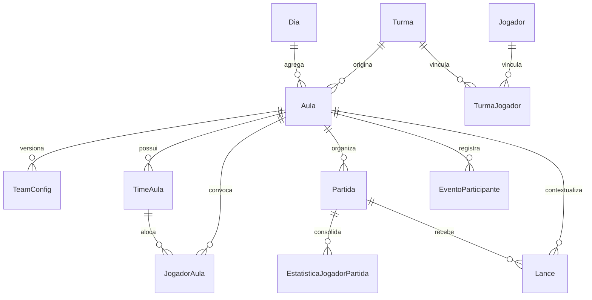

> Status: Historico / Superseded
> Substituido por: docs/current/*, docs/adr/* ou docs/plans/v0.3/*.
> Nao usar como fonte de implementacao ativa sem validar contra a documentacao viva.
# Relatório técnico para implementação no Projeto Jubileu

## Resumo executivo

O repositório **FelipeDalMolin/projeto-jubileu** já tem uma direção arquitetural relativamente clara: backend em FastAPI com transição incremental de um domínio persistido em **Aula** para uma semântica mais ampla de **Evento**, frontend em React/Vite/TypeScript, banco em PostgreSQL com Alembic, e um read-model versionado de **WorkspaceAula** para atender a UI. Essa direção não está apenas no código; ela também aparece no backlog do entity["company","Linear","project management software"], especialmente nas decisões sobre read-model, estado versionado e manutenção de polling, sem adoção imediata de tempo real. fileciteturn173file0L1-L1 fileciteturn139file0L1-L1 fileciteturn177file0L1-L1 fileciteturn175file0L1-L1 fileciteturn176file0L1-L1

A melhor estratégia para uma tarefa ainda não especificada é **compatibility-first**: manter a persistência atual centrada em `Aula`, implementar novas regras em serviços ou módulos, preservar contratos públicos já consumidos pelo frontend e introduzir migrações apenas quando o ganho de modelagem justificar o custo operacional. Essa abordagem é coerente com as decisões arquiteturais registradas no backlog, com o `main.py` mantendo rotas legadas e aliases `/api`, e com a própria evolução recente de TeamConfig, WorkspaceAula e UI modular. fileciteturn175file0L1-L1 fileciteturn176file0L1-L1 fileciteturn177file0L1-L1 fileciteturn139file0L1-L1 fileciteturn179file0L1-L1 fileciteturn178file0L1-L1 fileciteturn180file0L1-L1

Os principais riscos hoje não estão na ausência de base técnica, e sim em **drift**: drift entre documentação e código, drift entre schema e modelos, drift entre estratégia de autenticação documentada e implementada, drift entre UI utilitária moderna e páginas ainda com estilos inline ou classes de Bootstrap sem dependência declarada, e drift entre o que é validado em testes SQLite e o que realmente roda em PostgreSQL. Em outras palavras, o projeto já consegue receber bem uma nova tarefa, mas precisa de uma disciplina operacional maior para manter consistência à medida que evolui. fileciteturn174file0L1-L1 fileciteturn166file0L1-L1 fileciteturn167file0L1-L1 fileciteturn171file0L1-L1 fileciteturn145file0L1-L1 fileciteturn160file0L1-L1 fileciteturn161file0L1-L1 fileciteturn130file0L1-L1

A conclusão prática é simples: se a próxima tarefa for de back-end, banco, integração ou front-end, o caminho mais seguro é encaixá-la na arquitetura já emergente — **read-model para UI, serviço para regra, migration explícita para persistência, teste de regressão para contrato** — em vez de criar um atalho pontual dentro de router ou componente de página. Isso maximiza previsibilidade e reduz retrabalho futuro. fileciteturn175file0L1-L1 fileciteturn176file0L1-L1 fileciteturn177file0L1-L1

## Leitura arquitetural do repositório

No entity["company","GitHub","code hosting platform"] público, o repositório aparece com branch principal operacional `jubileu-v2`, cerca de 77 commits visíveis na interface, estrutura inicial organizada em `backend/`, `frontend/`, `docs/`, `scripts/` e um `docker-compose.yml`, além de zero issues e zero pull requests abertas no momento da captura pública. O README descreve o sistema como uma aplicação para gerenciamento de eventos esportivos, jogadores, partidas e estatísticas, e documenta uma topologia conceitual React/Vite/TypeScript → NGINX → FastAPI → PostgreSQL. citeturn10view1

Na prática, o backend já está mais modular do que parte da documentação sugere. O `main.py` cria a aplicação FastAPI, injeta CORS e registra rotas legadas e aliases `/api` para boa parte dos routers. Há um módulo de autenticação em `app/modules/auth/*`, uma camada de configuração em `app/core/config.py`, sessão em `app/db/session.py`, bridge de compatibilidade em `app/database.py` e um `env.py` do Alembic que aponta `target_metadata` para `Base.metadata` e importa `app.models`, exatamente no padrão recomendado pela documentação oficial do Alembic para autogeração e sincronização de metadata. fileciteturn139file0L1-L1 fileciteturn127file0L1-L1 fileciteturn129file0L1-L1 fileciteturn128file0L1-L1 fileciteturn165file0L1-L1 citeturn5view0turn5view1

O domínio persistido atual é nitidamente centrado em `Dia`, `Aula`, `TimeAula`, `JogadorAula`, `Partida`, `EstatisticaJogadorPartida`, `EventoParticipante`, `Lance` e `TeamConfig`. A documentação de domínio reconhece explicitamente que a persistência ainda é “Aula-cêntrica”, enquanto a direção semântica desejada é “Evento-cêntrica”, e que `JogadorAula` e `EventoParticipante` ainda coexistem numa zona de sobreposição conceitual controlada. O código confirma isso: `Aula` agrega times, jogadores, partidas, participantes, lances e configs versionadas; `TeamConfig` guarda snapshots versionados de equipes; `EventoParticipante` e `Lance` introduzem histórico operacional no estilo append-only. fileciteturn173file0L1-L1 fileciteturn133file0L1-L1 fileciteturn135file0L1-L1 fileciteturn136file0L1-L1 fileciteturn137file0L1-L1 fileciteturn138file0L1-L1

O frontend também mostra um estado de transição. O `package.json` é enxuto, com React 19, React Router, Tailwind e ESLint, sem TanStack Query e sem dependência declarada de Bootstrap. As rotas principais estão em `AppRoutes.tsx` e cobrem login, dias, aulas, eventos, turmas, jogadores e dashboards. O consumo de API é majoritariamente manual, com hooks e services próprios; o workspace de aula, por exemplo, usa `fetch`, `since_version` e polling com `setTimeout`, em vez de uma biblioteca de server state. O backlog do Linear deixa claro que essa foi uma decisão deliberada: read-model estruturado para UI, polling versionado e, por ora, sem MQTT/WebSocket como mecanismo principal. fileciteturn158file0L1-L1 fileciteturn121file0L1-L1 fileciteturn147file0L1-L1 fileciteturn148file0L1-L1 fileciteturn175file0L1-L1 fileciteturn181file0L1-L1

As migrations mostram uma história realista de evolução: a base `0001` cria o desenho inicial; `0003` remove `defesas`; `0007` corrige `aulas.turma_id` de `varchar` para `integer` com FK; `0009` adiciona versionamento a `aula_equipes_estado`; `e4f71ddd9d18` resolve merge heads; `0010` cria `team_configs`; `0011` adiciona status de partidas, participantes de evento e lances. Isso confirma duas coisas: o projeto já resolveu parte importante da modelagem que uma tarefa nova pode reutilizar, mas o histórico de migrations é suficientemente complexo para exigir rollback claro, teste real em PostgreSQL e atenção a drift de schema. Os testes cobrem workspace, auth JWT/RBAC e fluxo de eventos, mas a fixture principal usa SQLite em memória, mesmo com o código de produção proibindo SQLite como banco real. fileciteturn166file0L1-L1 fileciteturn172file0L1-L1 fileciteturn167file0L1-L1 fileciteturn168file0L1-L1 fileciteturn171file0L1-L1 fileciteturn169file0L1-L1 fileciteturn170file0L1-L1 fileciteturn130file0L1-L1 fileciteturn149file0L1-L1 fileciteturn150file0L1-L1 fileciteturn151file0L1-L1



O diagrama acima resume a topologia persistida mais relevante encontrada no código e na documentação, e deixa claro um ponto importante para tarefas futuras: o eixo técnico real do sistema ainda é `Dia -> Aula -> TeamConfig/TimeAula/JogadorAula/Partida`, enquanto `Evento` funciona hoje mais como linguagem de produto, endpoints específicos e backlog arquitetural do que como renomeação completa da persistência. fileciteturn173file0L1-L1 fileciteturn135file0L1-L1 fileciteturn136file0L1-L1 fileciteturn137file0L1-L1

## Lacunas, inconsistências e dívida técnica

A inconsistência mais visível é de **versão e documentação**. O README público apresenta `0.2.0` como versão atual em abril de 2026, o backend expõe `APP_VERSION = "0.1.0"`, e o frontend declara `"version": "0.0.0"` em `package.json`. Em paralelo, o README e a arquitetura documentam NGINX como parte do fluxo de implantação, mas o artefato operacional presente no repositório raiz é um `docker-compose.yml` com apenas um serviço PostgreSQL. Isso não torna o projeto errado, mas diminui a confiabilidade da documentação como “fonte única da verdade” para implementação de novas tarefas. citeturn10view1 fileciteturn127file0L1-L1 fileciteturn158file0L1-L1 fileciteturn157file0L1-L1 fileciteturn174file0L1-L1

A área de **autenticação** é hoje o hotspot mais crítico. No backend, há contas default codificadas no source (`admin/admin123`, `coach/coach123`, etc.), JWT assinado manualmente com HMAC e `JWT_SECRET` default como `"CHANGE_ME"`. No frontend, `AuthContext` persiste sessão em `localStorage` e, se o login JWT falha, faz fallback silencioso para modo legado, permitindo entrar como `user` local mesmo sem bearer token. Isso é ótimo para desenvolvimento rápido e compatibilidade, mas introduz risco de comportamento ambíguo, enfraquece a validação de fluxo real e dificulta distinguir bug de autenticação de fallback de conveniência. fileciteturn125file0L1-L1 fileciteturn126file0L1-L1 fileciteturn127file0L1-L1 fileciteturn145file0L1-L1 fileciteturn146file0L1-L1

A dívida de **UI e design system** também é significativa. O repositório configurou Tailwind, utilitários (`clsx`, `tailwind-merge`) e até um `Button` utilitário consistente, mas páginas importantes ainda usam estilos inline extensivos e classes típicas de Bootstrap (`container`, `btn`, `card`, `form-control`) sem que `bootstrap` apareça no `package.json`. Isso sugere uma UI em transição: parte antiga, parte nova, com fragmentação de padrões e maior custo de manutenção cada vez que uma tarefa de front precisa tocar componentes compartilhados. fileciteturn158file0L1-L1 fileciteturn159file0L1-L1 fileciteturn160file0L1-L1 fileciteturn161file0L1-L1

No banco e em migrations, a dívida é menos conceitual e mais **operacional**. O histórico evidencia correções de schema, remoção de colunas, merge de heads e criação de estruturas idempotentes para resolver drift anterior. Isso é perfeitamente administrável, mas significa que qualquer tarefa que altere persistência precisa nascer já com estratégia de migração, teste em PostgreSQL e rollback. A documentação de arquitetura reconhece isso explicitamente, e os testes atuais ainda não cobrem integralmente diferenças de PostgreSQL como enums, defaults e DDL transacional porque a suíte central usa SQLite em memória. fileciteturn166file0L1-L1 fileciteturn167file0L1-L1 fileciteturn171file0L1-L1 fileciteturn174file0L1-L1 fileciteturn130file0L1-L1

Há ainda inconsistências pequenas, mas com alto valor de correção: o `requirements.txt` e o `.env.example` do backend usam `psycopg`/psycopg3, enquanto o Quick Start documenta `psycopg2` no exemplo de `DATABASE_URL`; no frontend, o `.env.example` usa `VITE_API_BASE_URL`, enquanto o Quick Start mostra `VITE_API_URL`; o README e parte da arquitetura ainda descrevem estado anterior da modularização, enquanto o código já avançou para `app/core`, `app/db` e `app/modules/auth`. Esses detalhes parecem cosméticos, mas são exatamente o tipo de ruído que faz uma tarefa simples consumir horas em setup, onboarding ou troubleshooting. fileciteturn154file0L1-L1 fileciteturn155file0L1-L1 fileciteturn156file0L1-L1 fileciteturn153file0L1-L1 fileciteturn174file0L1-L1 fileciteturn139file0L1-L1

## Plano de implementação priorizado

Como o problema exato, a camada-alvo e a natureza da mudança ainda não foram especificados, o plano abaixo foi desenhado como **roteiro adaptável**, mas amarrado aos pontos reais do repositório. A prioridade não é “mexer primeiro no código”; é **congelar critério de aceite e contrato**, depois tocar a menor superfície possível. Essa sequência é a que mais respeita a arquitetura e evita regressões em um repositório já em transição incremental. fileciteturn175file0L1-L1 fileciteturn176file0L1-L1 fileciteturn177file0L1-L1

| Tipo de tarefa provável | Arquivos mais prováveis | Esforço | Migração | Observação |
|---|---|---:|---|---|
| Ajuste de regra em Aula/Evento/Workspace | `backend/jubileu-api-fastapi/app/routers/dias.py`, `app/routers/eventos.py`, novo `app/services/...`, `tests/test_workspace_aula.py`, `tests/test_eventos_api.py` | M | Não, em geral | Melhor caminho para regra de negócio ou DTO |
| Nova entidade persistida ligada a Aula/Evento | `app/models/dia_aula_*.py` ou novo model, `alembic/versions/*`, router/service correspondente, testes de API e migration | M–L | Sim | Só abra migration se a regra precisa durar no banco |
| Mudança de autenticação/autorização | `app/modules/auth/*`, `app/deps_auth.py`, `frontend/src/context/AuthContext.tsx`, `frontend/src/services/authService.ts`, `.env.example` | M | Não | Prioridade alta de segurança, baixa de produto |
| Integração de UI em tela existente | `frontend/src/pages/...`, `frontend/src/hooks/...`, `frontend/src/services/...`, `src/routes/AppRoutes.tsx` | S–M | Não | Preferir composição por service/hook, não lógica na página |
| Hardening de infra/dev experience | `docker-compose.yml`, `scripts/setup_backend.sh`, `docs/QUICK_START.md`, `.env.example`, pipeline de teste | S–M | Não | Alto retorno, baixo risco |
| Evolução de timeline/eventos append-only | `app/models/dia_aula_event.py`, `app/routers/eventos.py`, `app/routers/partidas.py`, migration nova, `tests/test_eventos_api.py`, UI de partidas | L | Sim | Já há backlog explícito no Linear para isso |

A recomendação prática é tratar a próxima tarefa em **cinco fases curtas**. Primeiro, determinar se ela altera só contrato/read-model ou se exige esquema novo. Segundo, atacar a regra em serviço e deixar o router o mais fino possível. Terceiro, abrir migration apenas se a persistência nova for inevitável; se a mudança puder ser representada como read-model derivado, evite custo de schema. Quarto, integrar no frontend por `service + hook + page`, e não por fetch local espalhado. Quinto, fechar com teste e atualização de documentação operacional. Esse fluxo é exatamente o que o próprio backlog do Linear já materializa em TeamConfig, WorkspaceAula e UI da Aula. fileciteturn179file0L1-L1 fileciteturn178file0L1-L1 fileciteturn180file0L1-L1 fileciteturn181file0L1-L1

```mermaid
flowchart LR
    A[Definir problema e aceite] --> B[Mapear agregado afetado]
    B --> C{Precisa mudar schema?}
    C -- Não --> D[Implementar serviço e DTO]
    C -- Sim --> E[Model + migration + rollback]
    D --> F[Teste de contrato e regressão]
    E --> F
    F --> G[Integração React por service/hook]
    G --> H[Smoke test em PostgreSQL]
    H --> I[Atualizar docs e setup]
```



Se eu precisasse priorizar **uma** melhoria estrutural antes de quase qualquer nova tarefa, seria: criar uma trilha de teste mínima em PostgreSQL real para migrations e contratos principais. O segundo investimento com melhor retorno seria endurecer auth para remover fallback silencioso e segredos default. O terceiro seria consolidar o padrão de front — ou Tailwind/utilitários, ou outro sistema — para que novas telas não continuem ampliando a fragmentação existente. fileciteturn130file0L1-L1 fileciteturn125file0L1-L1 fileciteturn145file0L1-L1 fileciteturn158file0L1-L1 fileciteturn159file0L1-L1

## Padrões, snippets e alternativas

Os snippets abaixo não assumem a tarefa final do usuário; eles mostram **o jeito certo de ligar uma mudança full-stack a este repositório**. Usei como exemplo um subrecurso `evento_notas`, porque ele é simples, cabe no domínio atual e demonstra o que costuma ser necessário em model, migration, router, integração React e Compose. O padrão foi derivado do desenho atual de modelos, auth modular, rotas `/api` e serviços React próprios. fileciteturn135file0L1-L1 fileciteturn137file0L1-L1 fileciteturn140file0L1-L1 fileciteturn146file0L1-L1

```python
# backend/jubileu-api-fastapi/app/models/evento_nota.py
from __future__ import annotations

from datetime import datetime
from typing import Optional

from sqlalchemy import DateTime, ForeignKey, Integer, String, Text, func
from sqlalchemy.orm import Mapped, mapped_column, relationship

from app.database import Base

class EventoNota(Base):
    __tablename__ = "evento_notas"

    id: Mapped[int] = mapped_column(Integer, primary_key=True, index=True)
    aula_id: Mapped[int] = mapped_column(ForeignKey("aulas.id"), nullable=False, index=True)
    titulo: Mapped[str] = mapped_column(String(120), nullable=False)
    conteudo: Mapped[str] = mapped_column(Text, nullable=False)
    created_by_user_id: Mapped[Optional[str]] = mapped_column(String, nullable=True)
    created_at: Mapped[datetime] = mapped_column(
        DateTime(timezone=True),
        nullable=False,
        server_default=func.now(),
    )

    aula = relationship("Aula")
```

```python
# backend/jubileu-api-fastapi/alembic/versions/xxxx_evento_notas.py
from alembic import op
import sqlalchemy as sa

revision = "xxxx_evento_notas"
down_revision = "0011_evento_participantes_lances"
branch_labels = None
depends_on = None

def upgrade() -> None:
    op.create_table(
        "evento_notas",
        sa.Column("id", sa.Integer(), primary_key=True),
        sa.Column("aula_id", sa.Integer(), sa.ForeignKey("aulas.id"), nullable=False),
        sa.Column("titulo", sa.String(length=120), nullable=False),
        sa.Column("conteudo", sa.Text(), nullable=False),
        sa.Column("created_by_user_id", sa.String(), nullable=True),
        sa.Column("created_at", sa.DateTime(timezone=True), nullable=False, server_default=sa.func.now()),
    )
    op.create_index("ix_evento_notas_aula_id", "evento_notas", ["aula_id"])

def downgrade() -> None:
    op.drop_index("ix_evento_notas_aula_id", table_name="evento_notas")
    op.drop_table("evento_notas")
```

```python
# backend/jubileu-api-fastapi/app/routers/evento_notas.py
from fastapi import APIRouter, Depends, HTTPException, status
from pydantic import BaseModel, Field
from sqlalchemy.orm import Session

from app.deps import get_db
from app.modules.auth.deps import get_current_user, AuthUser
from app.models.evento_nota import EventoNota
from app.models.dia_aula import Aula

router = APIRouter(prefix="/api/eventos", tags=["Eventos"])

class EventoNotaIn(BaseModel):
    titulo: str = Field(min_length=1, max_length=120)
    conteudo: str = Field(min_length=1)

class EventoNotaOut(BaseModel):
    id: int
    aula_id: int
    titulo: str
    conteudo: str
    created_by_user_id: str | None

@router.get("/{evento_id}/notas", response_model=list[EventoNotaOut])
def listar_notas(
    evento_id: int,
    db: Session = Depends(get_db),
    user: AuthUser = Depends(get_current_user),
):
    aula = db.get(Aula, evento_id)
    if not aula:
        raise HTTPException(status_code=status.HTTP_404_NOT_FOUND, detail="Evento não encontrado")

    notas = (
        db.query(EventoNota)
        .filter(EventoNota.aula_id == evento_id)
        .order_by(EventoNota.id.desc())
        .all()
    )
    return notas

@router.post("/{evento_id}/notas", response_model=EventoNotaOut, status_code=status.HTTP_201_CREATED)
def criar_nota(
    evento_id: int,
    payload: EventoNotaIn,
    db: Session = Depends(get_db),
    user: AuthUser = Depends(get_current_user),
):
    aula = db.get(Aula, evento_id)
    if not aula:
        raise HTTPException(status_code=status.HTTP_404_NOT_FOUND, detail="Evento não encontrado")

    nota = EventoNota(
        aula_id=evento_id,
        titulo=payload.titulo.strip(),
        conteudo=payload.conteudo.strip(),
        created_by_user_id=user.user_id,
    )
    db.add(nota)
    db.commit()
    db.refresh(nota)
    return nota
```

```ts
// frontend/jubileu-web/src/services/eventos/notasService.ts
const API_BASE_URL = import.meta.env.VITE_API_BASE_URL ?? "http://localhost:8000";

function buildUrl(path: string) {
  const base = API_BASE_URL.replace(/\/+$/, "");
  const p = path.startsWith("/") ? path : `/${path}`;
  return `${base}${p}`;
}

export type EventoNota = {
  id: number;
  aula_id: number;
  titulo: string;
  conteudo: string;
  created_by_user_id: string | null;
};

export async function listarNotasEvento(eventoId: number, token?: string) {
  const resp = await fetch(buildUrl(`/api/eventos/${eventoId}/notas`), {
    headers: token ? { Authorization: `Bearer ${token}` } : {},
  });
  if (!resp.ok) throw new Error(`Erro ao listar notas: ${resp.status}`);
  return (await resp.json()) as EventoNota[];
}

export async function criarNotaEvento(
  eventoId: number,
  input: { titulo: string; conteudo: string },
  token?: string,
) {
  const resp = await fetch(buildUrl(`/api/eventos/${eventoId}/notas`), {
    method: "POST",
    headers: {
      "Content-Type": "application/json",
      ...(token ? { Authorization: `Bearer ${token}` } : {}),
    },
    body: JSON.stringify(input),
  });
  if (!resp.ok) throw new Error(`Erro ao criar nota: ${resp.status}`);
  return (await resp.json()) as EventoNota;
}
```

```tsx
// ponto de integração em EventoPage.tsx
import { useEffect, useState } from "react";
import { criarNotaEvento, listarNotasEvento, type EventoNota } from "../../services/eventos/notasService";
import { useAuth } from "../../context/AuthContext";

function EventoNotasPanel({ eventoId }: { eventoId: number }) {
  const { user } = useAuth();
  const [notas, setNotas] = useState<EventoNota[]>([]);

  useEffect(() => {
    void listarNotasEvento(eventoId, user?.accessToken ?? undefined).then(setNotas);
  }, [eventoId, user?.accessToken]);

  async function onSubmit() {
    const nova = await criarNotaEvento(
      eventoId,
      { titulo: "Observação", conteudo: "Texto da anotação" },
      user?.accessToken ?? undefined,
    );
    setNotas((prev) => [nova, ...prev]);
  }

  return (
    <section>
      <button onClick={onSubmit}>Adicionar nota</button>
      <ul>{notas.map((n) => <li key={n.id}>{n.titulo}</li>)}</ul>
    </section>
  );
}
```

O `docker-compose.yml` atual é suficiente para levantar um PostgreSQL local, mas está minimalista e usa a chave `version`, que a especificação atual do Docker trata como obsoleta. Como o próprio Docker documenta, o ideal é usar Compose Specification, remover a dependência do campo `version` e, quando houver serviço de API no stack, usar `healthcheck` com `depends_on.condition: service_healthy` para evitar race condition na subida. fileciteturn157file0L1-L1 citeturn9search0turn7search0turn9search1

```yaml
name: jubileu

services:
  db:
    image: postgres:16
    container_name: jubileu_postgres
    restart: unless-stopped
    environment:
      POSTGRES_DB: jubileu
      POSTGRES_USER: postgres
      POSTGRES_PASSWORD: postgres
    ports:
      - "5432:5432"
    volumes:
      - postgres_data:/var/lib/postgresql/data
    healthcheck:
      test: ["CMD-SHELL", "pg_isready -U $$POSTGRES_USER -d $$POSTGRES_DB"]
      interval: 10s
      timeout: 5s
      retries: 5
      start_period: 15s

volumes:
  postgres_data:
```

Para evolução de leitura e sincronização de estado no frontend, eu recomendo avaliar a tabela abaixo antes de começar qualquer refactor maior. Hoje o repositório usa polling manual com `since_version`; isso é coerente com o backlog do Linear e com a existência de read-model orientado à UI. O React oficial observa que buscar dados diretamente em `useEffect` é uma abordagem muito manual, com riscos de waterfall e ausência de cache; já o TanStack Query fornece cache, refetch controlado e polling nativo. Meu diagnóstico é: **não** iria direto para WebSocket/MQTT agora; primeiro consolidaria REST versionado e, se o front ficar mais complexo, migraria o polling manual para TanStack Query. fileciteturn175file0L1-L1 fileciteturn181file0L1-L1 fileciteturn147file0L1-L1 fileciteturn148file0L1-L1 citeturn6search4turn6search1turn6search5

| Padrão | Situação no repo | Vantagens | Desvantagens | Recomendação |
|---|---|---|---|---|
| Polling manual com `fetch` + `since_version` | Já implementado | Baixo custo, sem nova dependência, combina com WorkspaceAula | Mais boilerplate, cache manual, mais propenso a inconsistência | Bom default de curto prazo |
| TanStack Query sobre as mesmas rotas REST | Não implementado | Cache, invalidação, polling declarativo, retry e controle de staleness | Introduz biblioteca e padrão novo de estado | Melhor evolução de médio prazo |
| MQTT/WebSocket/tempo real ativo | Deliberadamente adiado | Menor latência percebida | Maior custo de infra, observabilidade e sincronização | Não priorizar agora |

## Comandos operacionais e limitações

Os comandos realmente documentados no repositório mostram um fluxo simples para desenvolvimento. No backend, o setup shell instala dependências, roda `alembic upgrade head` e recomenda iniciar com `uvicorn app.main:app --reload`; o Quick Start também documenta `pytest tests/ -v`. No frontend, os scripts declarados são `dev`, `build`, `lint` e `preview`. No Docker, o artefato de raiz hoje levanta apenas o banco PostgreSQL. fileciteturn144file0L1-L1 fileciteturn153file0L1-L1 fileciteturn158file0L1-L1 fileciteturn157file0L1-L1

```bash
# backend
cd backend/jubileu-api-fastapi
python -m venv .venv
source .venv/bin/activate   # Windows: .\.venv\Scripts\Activate.ps1
pip install -r requirements.txt
alembic upgrade head
uvicorn app.main:app --reload --port 8000
pytest tests/ -v
```

```bash
# frontend
cd frontend/jubileu-web
npm install
npm run dev
npm run build
npm run lint
npm run preview
```

```bash
# banco local
docker compose up -d db
docker compose ps
docker compose logs -f db
docker compose down
```

Eu não encontrei, nos arquivos inspecionados, um comando de lint equivalente para o backend como há no frontend; portanto, se a próxima tarefa tiver impacto relevante em Python, vale incluir no mesmo pacote de mudança um padrão explícito de lint/format para backend, mesmo que isso seja feito depois em PR separado. O mesmo vale para pipeline de teste em PostgreSQL: hoje a suíte útil existe, mas não fecha completamente a lacuna entre ambiente de teste e ambiente de produção. fileciteturn158file0L1-L1 fileciteturn154file0L1-L1 fileciteturn130file0L1-L1

Como limitações desta pesquisa, três dados continuam abertos porque não vieram especificados pelo pedido original: qual é o problema exato a resolver, em qual camada ele cai primeiro e se a tarefa é extensão de um fluxo já existente ou recurso novo. Sem isso, o plano acima é o melhor “arcabouço de implementação” possível, mas não escolhe sozinho entre, por exemplo, tocar `dias.py`, `eventos.py`, `partidas.py`, `AuthContext.tsx` ou abrir nova migration. Ainda assim, o diagnóstico de alto nível é robusto: o caminho mais seguro para qualquer tarefa futura é respeitar o eixo `Aula` persistida + `Evento` semântico + `WorkspaceAula` como read-model + `TeamConfig` como snapshot versionado, e corrigir em paralelo os principais pontos de drift que hoje elevam o custo de mudança. fileciteturn173file0L1-L1 fileciteturn177file0L1-L1 fileciteturn179file0L1-L1
