> Status: Historico / Superseded
> Substituido por: docs/current/*, docs/adr/* ou docs/plans/v0.3/*.
> Nao usar como fonte de implementacao ativa sem validar contra a documentacao viva.
# Revisão técnica e roadmap do projeto Jubileu

## Resumo executivo

Este relatório analisa o repositório urlFelipeDalMolin/projeto-jubileuhttps://github.com/FelipeDalMolin/projeto-jubileu a partir dos conectores habilitados em urlGitHubhttps://github.com e urlLinearhttps://linear.app. O quadro geral é de um projeto que evoluiu em ciclos relativamente claros: bootstrap de backend/frontend no fim de 2025, onda forte de PRs focadas em `WorkspaceAula` e UI modular em janeiro de 2026, depois uma retomada importante em abril-maio de 2026 para promover `Evento` a entidade canônica, introduzir `Usuario` persistido e atualizar frontend, contratos e documentação. O commit atual de topo observado no código é “ajustes e remoção Aula como domínio”, o que confirma que o corte canônico está materializado no working tree. fileciteturn126file0L1-L1 fileciteturn128file0L1-L1 fileciteturn127file0L1-L1 fileciteturn96file0L1-L1

A conclusão principal é que o projeto está tecnicamente mais maduro do que a documentação histórica de janeiro sugeria, mas ainda não está “pronto para operar com baixo risco” sem fechar quatro frentes: hardening de autenticação/segredos, automação de CI/CD e release gate, consolidação de polling/performance na UI operacional, e padronização visual/acessível dos dashboards. O backlog aberto no Linear está coerente com esse diagnóstico, especialmente nas trilhas DEV-35 a DEV-41 e DEV-27/DEV-32. fileciteturn98file0L1-L1 fileciteturn99file0L1-L1 fileciteturn100file0L1-L1 fileciteturn101file0L1-L1 fileciteturn102file0L1-L1 fileciteturn103file0L1-L1

As maiores prioridades para as próximas semanas, em ordem, são: fechar a migração canônica com validação real em PostgreSQL e rollback controlado; substituir/fortalecer o modelo atual de autenticação; estabilizar a UI operacional com foco em polling, feedback de erro e consistência de design; e automatizar a esteira mínima de qualidade com pytest, lint, build, migrações e smoke checks. Orçamento, tamanho do time, meta de release e ambiente produtivo não foram especificados; por isso, as estimativas abaixo são apresentadas em esforço por papel, não como compromisso rígido de calendário. fileciteturn127file0L1-L1 fileciteturn128file0L1-L1

## Fontes, escopo e limitações

As fontes primárias usadas aqui foram: o próprio código e documentação do repositório, os PRs históricos visíveis no GitHub, os commits recuperáveis por busca no conector, e o backlog/projeto do Linear. No Linear, os artefatos centrais encontrados foram as equipes “Jubileu Core” e “Jubileu Dev”, além do projeto “Evento Canonico + Usuario”, que formaliza a retomada de maio de 2026. fileciteturn95file0L1-L1 fileciteturn90file0L1-L1 fileciteturn96file0L1-L1

Há três limitações relevantes. A primeira é que o conector do GitHub não expôs uma listagem consolidada de tags/releases nativas nem uma contagem formal de contributors; por isso, a análise de releases foi ancorada no arquivo `docs/RELEASES.md` do próprio repositório, e a análise de autoria se baseia na autoria observável em PRs e issues do Linear. A segunda é que não houve captura de runtime real em navegador, profiling ou Lighthouse; a avaliação de UI/UX, performance e acessibilidade é baseada em inspeção de código. A terceira é que não há evidência suficiente, nos conectores expostos, para afirmar a existência de pipelines automatizados; o que existe de forma comprovável é uma validação manual documentada por build/lint/pytest e smoke local. fileciteturn127file0L1-L1 fileciteturn111file0L1-L1 fileciteturn112file0L1-L1 fileciteturn113file0L1-L1 fileciteturn114file0L1-L1

## Evolução do projeto

A trajetória observável do código tem quatro fases. A primeira, entre novembro e dezembro de 2025, é de fundação técnica: entrada do frontend React/Vite, evolução do backend FastAPI e várias correções de integração, migração e ambiente. A segunda, em janeiro de 2026, é a fase mais “processada” por branches e PRs, quando entram `WorkspaceAula`, KPIs, warnings, UI modular, testes do endpoint versionado, fluxo de presença, `TeamConfig` e status/tipo da aula. A terceira, em março e abril de 2026, é de organização documental e ajustes de autenticação/evento. A quarta, já em maio de 2026, é o corte de domínio: rotação manual, decisão de `Evento` canônico, migração de persistência e introdução de `Usuario`. fileciteturn120file0L1-L1 fileciteturn115file0L1-L1 fileciteturn116file0L1-L1 fileciteturn117file0L1-L1 fileciteturn118file0L1-L1 fileciteturn126file0L1-L1

O histórico de PRs confirma que o fluxo formal de integração observado no GitHub foi especialmente forte em janeiro. PR #1 implementou o `WorkspaceAula` com endpoint versionado; PR #4 adicionou warnings e testes; PR #10 estabilizou `TeamConfig`; PR #11 consolidou a nova UI do workspace. Todas essas PRs foram mergeadas na branch `jubileu-v2`, com autoria observável concentrada em Felipe Dal Molin, o que sugere uma estrutura de manutenção altamente centralizada. fileciteturn112file0L1-L1 fileciteturn113file0L1-L1 fileciteturn114file0L1-L1 fileciteturn111file0L1-L1

É importante notar também uma mudança de convenção de branch. No GitHub histórico, as PRs usam `feature/DEV-*`; no Linear de maio, os itens já sugerem branches no padrão `felipemolin/dev-*`. Isso não é um problema em si, mas é um sinal de drift de workflow: o projeto parece ter migrado de um modelo de feature branches “curtas e semânticas” para um modelo mais orientado a issue e retomada contínua em branch pessoal. Sem padronização explícita, isso tende a elevar o custo de revisão, rastreabilidade e automação. fileciteturn112file0L1-L1 fileciteturn114file0L1-L1 fileciteturn98file0L1-L1 fileciteturn99file0L1-L1 fileciteturn100file0L1-L1 fileciteturn101file0L1-L1

Outro ponto importante é a divergência documental interna. `docs/DECISIONS.md` ainda registra que `WorkspaceEvento` deveria ser introduzido como adapter/read-model de transição e que `WorkspaceAula` permaneceria válido durante a transição. Já `docs/ROADMAP.md` e `docs/API.md` afirmam explicitamente que `Evento` é a entidade canônica, que as rotas públicas baseadas em `Aula` foram removidas e que a rota canônica do frontend passou a ser `/dias/:dataIso/eventos/:eventoId`. O código atual confirma a segunda visão. Portanto, existe uma decisão antiga que já foi superada na prática, mas ainda não foi formalmente substituída por um ADR de corte. fileciteturn130file0L1-L1 fileciteturn128file0L1-L1 fileciteturn129file0L1-L1 fileciteturn126file0L1-L1

```mermaid
timeline
    title Evolução observável do projeto
    2025-11 : Entrada do frontend React/Vite
            : Primeiros commits de UI operacional
    2025-12 : Bootstrap de ambiente, backend FastAPI, fixes de integração
    2026-01 : WorkspaceAula
            : KPIs e warnings
            : status/tipo da aula
            : confirmação de presenças
            : TeamConfig
            : nova UI modular
    2026-04 : organização de docs e ajustes de auth/evento
    2026-05 : rotação manual
            : corte canônico para Evento
            : Usuario persistido
            : roadmap/releases/API atualizados
```



A linha do tempo acima resume a cadência observada no histórico de commits, PRs e nos artefatos de roadmap/release do repositório. fileciteturn115file0L1-L1 fileciteturn111file0L1-L1 fileciteturn126file0L1-L1 fileciteturn127file0L1-L1

## Diagnóstico técnico do código e dos dashboards

Do ponto de vista arquitetural, o estado atual é coerente com o corte “Evento-first”. O arquivo principal da API inclui routers de `dias`, `eventos`, `partidas`, `auth` e `usuarios`, e também preserva aliases sob `/api`. No domínio, `Evento`, `TimeEvento`, `JogadorEvento` e `Usuario` já aparecem como modelos ativos; o roadmap e a API pública também foram atualizados para essa nomenclatura. Isso é positivo porque reduz a ambiguidade entre modelo persistido, contrato público e UI. fileciteturn126file0L1-L1 fileciteturn129file0L1-L1 fileciteturn128file0L1-L1

Ao mesmo tempo, há um risco forte em autenticação e segurança operacional. O backend usa `JWT_SECRET` com valor default `"CHANGE_ME"`, e o serviço de autenticação implementa seu próprio mecanismo com `sha256`, `hmac` e token caseiro, além de popular usuários default e persisti-los. No frontend, o token é salvo em `localStorage` e a sessão é reconstruída a partir desse storage. Isso funciona para MVP local, mas é fraco para um ambiente minimamente exposto: há acoplamento excessivo a segredos default, superfície para vazamento de token em XSS e ausência de uma camada explícita de rotação/revogação/sessão segura. fileciteturn29file0L1-L1 fileciteturn31file0L1-L1 fileciteturn37file0L1-L1 fileciteturn38file0L1-L1

No backend de domínio, a situação é melhor. Há suíte de testes pytest relevante, com `conftest.py` configurando banco SQLite em memória e `TestClient` para FastAPI, além de testes de smoke e contratos críticos de rota. O repositório também documenta que `pytest`, `npm run build` e `npm run lint` foram executados com sucesso em 2026-05-09 para o corte canônico. O ponto fraco aqui não é ausência total de testes, e sim o gap entre teste “unitário/in-memory” e validação real de produção: as próprias notas de release falam em risco PostgreSQL e em smoke visual pendente no navegador. fileciteturn71file0L1-L1 fileciteturn72file0L1-L1 fileciteturn69file22L1-L1 fileciteturn69file29L1-L1 fileciteturn127file0L1-L1

No frontend operacional, a principal fragilidade é performance previsível sob polling. O `QueryClient` usa `staleTime: 1000` e `retry: 1`; a `WorkspaceEventoPage` abre múltiplas queries com `refetchInterval` entre 2200 ms e 4000 ms, dependendo da aba, e o dashboard home também força carregamentos em paralelo na montagem. Isso explica por que o Linear abriu explicitamente DEV-32 para hardening de polling/auth por canal: o código já está melhor do que uma UI puramente “manual”, mas ainda pode fan-outar chamadas, produzir rajadas de 401 e degradar bastante a experiência em rede ruim ou sessão expirada. fileciteturn66file0L1-L1 fileciteturn40file0L1-L1 fileciteturn53file0L1-L1 fileciteturn102file0L1-L1

Nos dashboards, há um achado importante de consistência visual/técnica. O `package.json` da web lista React, React Router, TanStack Query e Tailwind; `main.tsx` importa apenas `index.css`; `index.css` inicia apenas Tailwind. Porém as telas de dashboard usam amplamente classes como `container`, `row`, `col-*`, `card`, `btn`, `alert`, `placeholder-wave` e `table-responsive`, que são idiomáticas de Bootstrap. Como eu não encontrei import explícito de Bootstrap nos arquivos inspecionados, há grande chance de dependência implícita, CSS residual ou inconsistência de design. Na prática, isso tende a produzir dívida visual, fragilidade em responsividade e dificuldade para construir um design system coerente. fileciteturn12file0L1-L1 fileciteturn58file0L1-L1 fileciteturn59file0L1-L1 fileciteturn53file0L1-L1 fileciteturn131file0L1-L1 fileciteturn132file0L1-L1

Em UX funcional, os dashboards são úteis como “scan surfaces”, mas ainda são superficiais. `DashboardHome` exibe resumos, atividade recente e top artilheiros; `DashboardJogadores` e `DashboardPartidas` já têm filtros, ordenação e drill-down simples. O problema é que eles não fecham o ciclo analítico: não há visualização gráfica de série temporal, não há comparação entre turmas, não há meta explícita por período, e a hierarquia visual ainda depende muito de tabelas e cards genéricos. Isso é coerente com o próprio roadmap, que classifica DEV-43 como apenas parcialmente implementado. fileciteturn53file0L1-L1 fileciteturn131file0L1-L1 fileciteturn132file0L1-L1 fileciteturn128file0L1-L1

Há também gaps claros de acessibilidade. O `index.html` ainda está com `lang="en"`, título genérico `jubileu-web` e favicon padrão do Vite. O componente de tabs usa apenas botões estilizados, sem semântica ARIA de tabs/tablist/panels. O `RankingTable` torna `<th>` clicável com `role="button"` e `onClick`, mas sem affordance de teclado equivalente. Os botões customizados não trazem foco visível explícito. Em resumo: a interface deve funcionar para muitos usuários, mas ainda não está pronta para ser considerada robusta em acessibilidade. fileciteturn55file0L1-L1 fileciteturn51file0L1-L1 fileciteturn52file0L1-L1 fileciteturn133file0L1-L1

### Síntese dos achados técnicos

| Área | Diagnóstico | Severidade | Leitura prática |
|---|---|---:|---|
| Modelo de domínio | `Evento` e `Usuario` já são canônicos no código ativo | Alta | Decisão correta; precisa fechamento formal e rollout |
| Segurança/auth | segredo default, token em `localStorage`, auth caseira | Alta | principal risco operacional imediato |
| Testes backend | existem e cobrem contratos críticos | Média | base razoável, mas ainda insuficiente para release sem CI |
| Frontend tests | não há evidência forte de suíte dedicada na inspeção | Média | build/lint não substituem teste de comportamento |
| Polling/performance | múltiplas queries com intervalos curtos e `staleTime` baixo | Alta | risco de flood, UX instável e erros repetidos |
| Dashboards | úteis, mas visualmente inconsistentes e pouco analíticos | Média | precisam de design system e mais profundidade |
| Acessibilidade | tabs, tabela ordenável, foco e metadados de documento incompletos | Média | correção relativamente barata e de alto valor |
| CI/CD | validação documentada é manual | Alta | gargalo para previsibilidade e release seguro |

A tabela acima sintetiza o que o código e os artefatos internos mostram hoje: evolução boa no domínio e no contrato, mas maturidade ainda incompleta em segurança, operação e governança de qualidade. fileciteturn126file0L1-L1 fileciteturn29file0L1-L1 fileciteturn31file0L1-L1 fileciteturn71file0L1-L1 fileciteturn72file0L1-L1 fileciteturn40file0L1-L1 fileciteturn53file0L1-L1 fileciteturn127file0L1-L1

## Backlog priorizado e recomendações de produto

O backlog aberto do Linear é razoavelmente alinhado ao estado real do repositório. Em especial, DEV-35 a DEV-38 tratam exatamente do corte canônico de `Evento` e `Usuario`; DEV-32 trata do problema de polling/auth que o código ainda materializa; DEV-27 cobre runtime/gateway/deploy, que continua como dependência para um release com menor risco; e DEV-41 fecha docs, validação e smoke final. Isso indica que o backlog não está “desconectado” do código — ao contrário, ele está bem calibrado, mas precisa ser reordenado em torno de risco e não apenas de sequência lógica. fileciteturn98file0L1-L1 fileciteturn99file0L1-L1 fileciteturn100file0L1-L1 fileciteturn101file0L1-L1 fileciteturn102file0L1-L1 fileciteturn103file0L1-L1

### Priorização recomendada

| Prioridade | Item | Motivo | Base sugerida |
|---|---|---|---|
| P0 | Fechar migração canônica `Evento` + `Usuario` com validação PostgreSQL e rollback | é a espinha dorsal da mudança de domínio e ainda concentra risco de quebra | DEV-35, DEV-36, DEV-38, DEV-41 |
| P0 | Hardening de autenticação e segredos | hoje é o maior risco operacional concreto | tarefa nova derivada do código atual |
| P0 | Automatizar CI mínimo | sem isso, o release gate continua manual | DEV-41 + DEV-27 |
| P1 | Hardening de polling/auth por canal | problema já identificado no Linear e ainda visível no código | DEV-32 |
| P1 | Consolidação visual e funcional dos dashboards | dashboards estão parcialmente entregues e ainda inconsistentes | DEV-40 |
| P1 | Infra MVP e gateway de produção | necessário para rollout confiável | DEV-27 |
| P2 | Testes frontend e smoke visual automatizado | fecha lacuna de regressão de UI | tarefa nova ou sub-slice |
| P2 | Redesign analítico dos dashboards | agrega valor de produto, mas não é o maior risco atual | evolução após estabilidade |

Minha leitura é que seria um erro começar agora por “embelezar” dashboards ou abrir novas features de fluxo enquanto auth, migração, CI e polling ainda estão incompletos. O custo de retrabalho nessa ordem errada seria alto. fileciteturn102file0L1-L1 fileciteturn103file0L1-L1 fileciteturn127file0L1-L1

### Melhorias visuais e funcionais para os dashboards

| Frente | Estado atual | Melhoria proposta |
|---|---|---|
| Design system | mistura de Tailwind com convenções visuais de Bootstrap | escolher uma base única e aplicar tokens/componentes consistentes |
| KPI cards | cards funcionais, mas genéricos | destacar variação vs período anterior e contexto da turma |
| Exploração analítica | tabelas e listas predominam | adicionar gráficos simples de série temporal, distribuição e comparação |
| Navegação | telas separadas, com drill-down local | padronizar filtros persistidos e breadcrumbs leves |
| Erros e vazios | já existem alerts básicos | tornar estados vazios instrutivos e com CTA operacional |
| Responsividade | “rolável no mobile”, mas pouco refinamento | revisar spacing, densidade e hierarquia para uso em quadra/celular |
| Acessibilidade | semântica incompleta | corrigir tabs, foco, sortable headers e metadados de documento |

Para consolidar a UI, eu recomendo **manter React + Tailwind + componentes próprios**, mas eliminar o uso incidental de convenções Bootstrap sem dependência explícita. Se a intenção for ganhar velocidade de consistência, há dois caminhos razoáveis: ou adotar uma camada de componentes mais robusta por cima do Tailwind já existente, ou importar formalmente Bootstrap e assumir essa decisão em todo o app. O pior cenário é o atual híbrido implícito. fileciteturn12file0L1-L1 fileciteturn59file0L1-L1 fileciteturn53file0L1-L1 fileciteturn131file0L1-L1 fileciteturn132file0L1-L1

## Roadmap sugerido

A proposta abaixo assume **capacidade não especificada**. Por isso, as estimativas estão em **horas/pessoa** e o cronograma em **milestones de esforço**. Para transformar isso em calendário, eu assumiria como referência mínima: 1 pessoa full-stack principal, com apoio parcial de QA e DevOps. Se houver menos capacidade, o correto é alongar o prazo, não cortar a validação.

### Plano de execução

| Milestone | Tarefa | Esforço | Dependências | Papel sugerido |
|---|---|---:|---|---|
| Fechamento canônico | validar migrations `0013` e `0014` em PostgreSQL limpo, com upgrade/downgrade e preservação de dados | 12–16h | nenhuma | Backend engineer |
| Fechamento canônico | revisar rotas públicas e remover resíduos de `Aula` em contrato ativo | 6–10h | migration validada | Backend engineer |
| Fechamento canônico | revisar `/usuario` e `auth/me` com foco em perfil persistido, consistência de campos e histórico | 8–12h | migration validada | Full-stack engineer |
| Segurança operacional | substituir hash/token caseiros por implementação mais robusta e remover segredos default | 16–24h | perfil persistido estável | Backend engineer |
| Segurança operacional | revisar armazenamento de token no frontend e expiração de sessão | 8–12h | hardening auth backend | Frontend engineer |
| Estabilidade de UI | consolidar polling por canal, backoff e tratamento central de 401/erro de rede | 12–16h | auth estável | Frontend engineer |
| Estabilidade de UI | unificar design system e remover dependência implícita de Bootstrap nas telas de dashboard | 20–28h | nenhuma | Frontend engineer |
| Qualidade | criar pipeline CI com lint, build, pytest, Alembic e smoke mínimo | 12–18h | migrations e auth revisados | DevOps / Full-stack |
| Qualidade | adicionar suíte frontend mínima de comportamento crítico | 16–24h | UI consolidada | Frontend engineer + QA |
| Release | executar smoke integrado login → usuário → evento AULA → JOGO_LIVRE → dashboards | 8–12h | CI verde | QA / Product engineer |
| Release | publicar release notes, decisão arquitetural de supersessão e checklist de rollback | 6–8h | smoke verde | Tech lead |

### Cronograma recomendado

```mermaid
gantt
    title Roadmap recomendado para o próximo ciclo
    dateFormat  YYYY-MM-DD
    section Fechamento canônico
    Migrations PostgreSQL e rollback       :a1, 2026-05-12, 3d
    Contratos Evento-only                  :a2, after a1, 2d
    Usuario/Auth consistente               :a3, after a1, 2d
    section Segurança e estabilidade
    Hardening auth e segredos              :b1, after a3, 4d
    Polling, 401 e backoff                 :b2, after b1, 3d
    section UI e dashboards
    Consolidação visual do dashboard       :c1, 2026-05-19, 5d
    Acessibilidade e estados vazios        :c2, after c1, 2d
    section Qualidade e release
    CI com build/lint/pytest/migration     :d1, 2026-05-19, 3d
    Testes frontend críticos               :d2, after d1, 4d
    Smoke integrado e release notes        :d3, after d2, 2d
```



Se eu tivesse que transformar isso em milestones executáveis, seriam estes:

| Milestone | Critério de pronto |
|---|---|
| Canonical cut fechado | migrations seguras, contratos `Evento-only`, `/usuario` e sessão estáveis |
| Operação segura | auth endurecida, sem segredo default e sem sessão frágil no cliente |
| UI estável | polling sem flood, dashboards coerentes, estados de erro/vazio claros |
| Release repetível | pipeline CI verde, smoke integrado reproduzível e rollback documentado |

O roadmap acima conversa diretamente com o projeto “Evento Canonico + Usuario” e com os itens abertos de DEV-35 a DEV-41, mas reordena o esforço em função de redução de risco. fileciteturn96file0L1-L1 fileciteturn98file0L1-L1 fileciteturn99file0L1-L1 fileciteturn100file0L1-L1 fileciteturn101file0L1-L1 fileciteturn127file0L1-L1

## Processo, métricas, reprodução e riscos

O processo de engenharia precisa ficar mais explícito do que está hoje. Minha recomendação é: manter branches curtas por issue, exigir PR para `jubileu-v2` ou para uma branch principal protegida, usar template de PR com link para a issue do Linear, checklist de migração e checklist de validação, e adotar um “release gate” automatizado. Em um cenário de time pequeno ou solo-maintainer, isso não é burocracia; é o mecanismo que evita regressão silenciosa em auth, migração e UI. O próprio repositório já mostra que as mudanças de maior valor vieram de slices bem delimitados e referências claras entre Core, Dev e docs. fileciteturn130file0L1-L1 fileciteturn127file0L1-L1 fileciteturn96file0L1-L1

As métricas que eu acompanharia são poucas, mas objetivas: tempo de ciclo por issue; tamanho médio de PR; taxa de falha do smoke integrado; tempo para corrigir quebra de migração; volume de requests por minuto nas telas com polling; taxa de 401 por sessão; tempo de carregamento de `WorkspaceEvento`; e percentual de builds verdes consecutivas. Essas métricas atacam diretamente os riscos reais evidenciados pelo código e pelo backlog, em vez de gerar um dashboard de engenharia “bonito porém inútil”. fileciteturn40file0L1-L1 fileciteturn66file0L1-L1 fileciteturn102file0L1-L1

### Comandos e queries úteis para reproduzir a análise

```bash
# Clonar e entrar na branch principal observada
git clone https://github.com/FelipeDalMolin/projeto-jubileu.git
cd projeto-jubileu
git checkout jubileu-v2

# Linha do tempo e evolução
git log --graph --decorate --oneline --all
git log --since="2025-11-01" --date=short --pretty=format:"%ad | %h | %s"
git shortlog -sn --all

# Histórico focado no corte canônico
git log --grep="Evento" --grep="Workspace" --grep="DEV-" --all --oneline
git show 6fb2c65e37caf8710dd6f9ce8394e169e311ee93 --stat
git show 931244b5be7ca091d2fcc06a9bdaedf02b404924 --stat

# Drift de nomenclatura e compatibilidade
git grep -nE "WorkspaceAula|/aulas/|aula_id|aulaId" -- . ':(exclude)backend/jubileu-api-fastapi/alembic/versions/*'
git grep -nE "WorkspaceEvento|/eventos/|evento_id|eventoId" -- .

# Polling e performance
git grep -nE "refetchInterval|staleTime|force: true" frontend/jubileu-web/src

# Segurança e sessão
git grep -nE "JWT_SECRET|CHANGE_ME|sha256|localStorage|access_token" backend frontend

# Dashboards e UI
git grep -nE "container|row|col-|card|btn|alert|table-responsive" frontend/jubileu-web/src/pages/dashboard frontend/jubileu-web/src/components/dashboard

# Backend
cd backend/jubileu-api-fastapi
python -m pytest
alembic upgrade head

# Frontend
cd ../../frontend/jubileu-web
npm install
npm run lint
npm run build
```

Os comandos acima refletem exatamente os focos que apareceram na inspeção: histórico, corte canônico, drift de nomenclatura, polling, segurança, dashboards e validação básica. Eles também são coerentes com os próprios artefatos de release e roadmap do projeto. fileciteturn127file0L1-L1 fileciteturn128file0L1-L1

### Riscos e mitigação

| Risco | Impacto | Probabilidade | Mitigação |
|---|---|---:|---|
| Migração `Aula` → `Evento` falhar em PostgreSQL real | Muito alto | Média | ambiente clone, backup, upgrade/downgrade automatizado, checklist de rollback |
| Auth atual vazar ou manter sessão insegura | Muito alto | Média/alta | remover segredos default, endurecer token/hashing, revisar storage de sessão |
| Polling gerar flood/401 em cascata | Alto | Alta | consolidação por canal, backoff, cache melhor configurado, telemetria |
| Dashboards quebrarem visualmente por stack híbrida CSS | Médio | Alta | escolher framework visual único e refatorar telas críticas |
| Release continuar dependente de smoke manual | Alto | Alta | CI com lint/build/pytest/migration + smoke automatizado |
| Divergência documental causar retrabalho | Médio | Média | publicar ADR de supersessão e limpar docs antigas conflituosas |
| Concentração de manutenção em uma pessoa | Médio | Alta | PR checklist, docs de rollback, automação, fatiamento menor de mudanças |

A mitigação mais importante, no curto prazo, não é uma feature de produto: é transformar o corte canônico em uma mudança segura, repetível e auditável. fileciteturn126file0L1-L1 fileciteturn127file0L1-L1 fileciteturn130file0L1-L1

### Questões em aberto e limitações

Alguns pontos continuam abertos porque não estão especificados ou não ficaram observáveis nos conectores disponíveis: orçamento; número de desenvolvedores disponíveis; ambiente alvo de produção/staging; política de secrets; existência formal de tags/releases do GitHub; e contagem consolidada de contributors. Também não foi possível validar a experiência visual em runtime ou medir performance real de browser. Esses itens não invalidam a análise, mas devem ser assumidos explicitamente antes de transformar este roadmap em compromisso de entrega.
