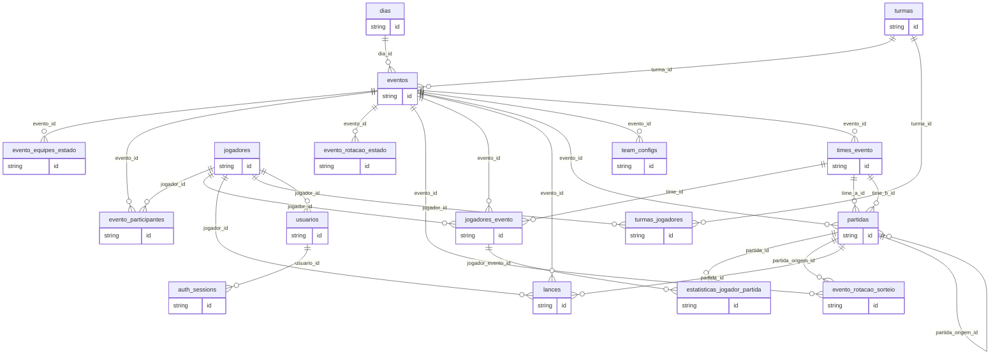

# Code Map

Arquivo gerado por `python3 scripts/docs/generate_code_map.py`.
Nao edite manualmente; atualize o codigo ou os docs vivos e gere novamente.

## Dominio Persistido

| Classe | Tabela | FKs |
|---|---|---|
| `AuthSession` | `auth_sessions` | usuario_id -> usuarios.id |
| `Dia` | `dias` | - |
| `EstatisticaJogadorPartida` | `estatisticas_jogador_partida` | partida_id -> partidas.id, jogador_evento_id -> jogadores_evento.id |
| `EventoEquipesEstado` | `evento_equipes_estado` | evento_id -> eventos.id |
| `EventoParticipante` | `evento_participantes` | evento_id -> eventos.id, jogador_id -> jogadores.id |
| `EventoRotacaoEstado` | `evento_rotacao_estado` | evento_id -> eventos.id |
| `EventoRotacaoSorteio` | `evento_rotacao_sorteio` | evento_id -> eventos.id, partida_origem_id -> partidas.id |
| `Evento` | `eventos` | dia_id -> dias.id, turma_id -> turmas.id |
| `Jogador` | `jogadores` | - |
| `JogadorEvento` | `jogadores_evento` | evento_id -> eventos.id, jogador_id -> jogadores.id, time_id -> times_evento.id |
| `Lance` | `lances` | partida_id -> partidas.id, evento_id -> eventos.id, jogador_id -> jogadores.id |
| `Partida` | `partidas` | evento_id -> eventos.id, time_a_id -> times_evento.id, time_b_id -> times_evento.id, partida_origem_id -> partidas.id |
| `TeamConfig` | `team_configs` | evento_id -> eventos.id |
| `TimeEvento` | `times_evento` | evento_id -> eventos.id |
| `Turma` | `turmas` | - |
| `TurmaJogador` | `turmas_jogadores` | turma_id -> turmas.id, jogador_id -> jogadores.id |
| `Usuario` | `usuarios` | jogador_id -> jogadores.id |

## Relacionamentos ORM

| Classe | Relacionamentos |
|---|---|
| `AuthSession` | - |
| `Dia` | `eventos` -> `Evento` (`back_populates=dia`) |
| `EstatisticaJogadorPartida` | `partida` -> `Partida` (`back_populates=estatisticas`); `jogador_evento` -> `JogadorEvento` |
| `EventoEquipesEstado` | `evento` -> `Evento` (`back_populates=estado_equipes`) |
| `EventoParticipante` | `evento` -> `Evento` (`back_populates=participantes`) |
| `EventoRotacaoEstado` | `evento` -> `Evento` (`back_populates=rotacao_estado`) |
| `EventoRotacaoSorteio` | `evento` -> `Evento` (`back_populates=rotacao_sorteios`); `partida_origem` -> `Partida` |
| `Evento` | `dia` -> `Dia` (`back_populates=eventos`); `turma` -> `Turma`; `estado_equipes` -> `EventoEquipesEstado` (`back_populates=evento`); `team_configs` -> `TeamConfig` (`back_populates=evento`); `times` -> `TimeEvento` (`back_populates=evento`); `jogadores` -> `JogadorEvento` (`back_populates=evento`); `partidas` -> `Partida` (`back_populates=evento`); `participantes` -> `EventoParticipante` (`back_populates=evento`); `lances` -> `Lance` (`back_populates=evento`); `rotacao_estado` -> `EventoRotacaoEstado` (`back_populates=evento`); `rotacao_sorteios` -> `EventoRotacaoSorteio` (`back_populates=evento`) |
| `Jogador` | `turmas_rel` -> `TurmaJogador` (`back_populates=jogador`) |
| `JogadorEvento` | `evento` -> `Evento` (`back_populates=jogadores`); `time` -> `TimeEvento` (`back_populates=jogadores`) |
| `Lance` | `partida` -> `Partida` (`back_populates=lances`); `evento` -> `Evento` (`back_populates=lances`) |
| `Partida` | `evento` -> `Evento` (`back_populates=partidas`); `estatisticas` -> `EstatisticaJogadorPartida` (`back_populates=partida`); `lances` -> `Lance` (`back_populates=partida`) |
| `TeamConfig` | `evento` -> `Evento` (`back_populates=team_configs`) |
| `TimeEvento` | `evento` -> `Evento` (`back_populates=times`); `jogadores` -> `JogadorEvento` (`back_populates=time`) |
| `Turma` | `jogadores_rel` -> `TurmaJogador` (`back_populates=turma`) |
| `TurmaJogador` | `turma` -> `Turma` (`back_populates=jogadores_rel`); `jogador` -> `Jogador` (`back_populates=turmas_rel`) |
| `Usuario` | - |

## ERD Gerado

## Rotas Backend Efetivas

### Publicas `/api`

| Metodo | Path |
|---|---|
| `GET` | `/api/auth/me` |
| `POST` | `/api/auth/login` |
| `POST` | `/api/auth/logout` |
| `POST` | `/api/auth/refresh` |

### Internas/Compatibilidade

| Metodo | Path |
|---|---|
| `DELETE` | `/dias/{data_iso}/eventos/{evento_id}` |
| `DELETE` | `/dias/{data_iso}/eventos/{evento_id}/partidas/{partida_id}` |
| `DELETE` | `/dias/{data_iso}/eventos/{evento_id}/times/{time_id}` |
| `DELETE` | `/eventos/{evento_id}/checkin` |
| `DELETE` | `/eventos/{evento_id}/rsvp` |
| `DELETE` | `/jogadores/{jogador_id}` |
| `DELETE` | `/turmas/{turma_id}` |
| `DELETE` | `/turmas/{turma_id}/jogadores/{jogador_id}` |
| `GET` | `/dashboards/estatisticas/visao-geral` |
| `GET` | `/dashboards/jogadores/ranking` |
| `GET` | `/dashboards/jogadores/resumo` |
| `GET` | `/dashboards/partidas/lista` |
| `GET` | `/dashboards/partidas/resumo` |
| `GET` | `/dashboards/partidas/serie-por-dia` |
| `GET` | `/dias` |
| `GET` | `/dias/{data_iso}` |
| `GET` | `/dias/{data_iso}/eventos/{evento_id}` |
| `GET` | `/dias/{data_iso}/eventos/{evento_id}/estado` |
| `GET` | `/dias/{data_iso}/eventos/{evento_id}/estado-equipes` |
| `GET` | `/dias/{data_iso}/eventos/{evento_id}/partidas` |
| `GET` | `/dias/{data_iso}/eventos/{evento_id}/workspace` |
| `GET` | `/eventos/{evento_id}/lances` |
| `GET` | `/eventos/{evento_id}/participants` |
| `GET` | `/eventos/{evento_id}/presentes` |
| `GET` | `/eventos/{evento_id}/rotacao/estado` |
| `GET` | `/jogadores` |
| `GET` | `/jogadores/{jogador_id}` |
| `GET` | `/turmas` |
| `GET` | `/turmas/{turma_id}` |
| `GET` | `/turmas/{turma_id}/jogadores` |
| `GET` | `/usuarios/me` |
| `PATCH` | `/eventos/{evento_id}/rotacao/estado` |
| `POST` | `/dias/{data_iso}/eventos` |
| `POST` | `/dias/{data_iso}/eventos/{evento_id}/partidas` |
| `POST` | `/dias/{data_iso}/eventos/{evento_id}/partidas/{partida_id}/end` |
| `POST` | `/dias/{data_iso}/eventos/{evento_id}/partidas/{partida_id}/start` |
| `POST` | `/dias/{data_iso}/eventos/{evento_id}/times` |
| `POST` | `/eventos/{evento_id}/cancel` |
| `POST` | `/eventos/{evento_id}/checkin` |
| `POST` | `/eventos/{evento_id}/end` |
| `POST` | `/eventos/{evento_id}/participants/{jogador_id}/checkin` |
| `POST` | `/eventos/{evento_id}/partidas/proxima` |
| `POST` | `/eventos/{evento_id}/partidas/seed` |
| `POST` | `/eventos/{evento_id}/rotacao/confirmar-sorteio` |
| `POST` | `/eventos/{evento_id}/rotacao/preview-sorteio` |
| `POST` | `/eventos/{evento_id}/rsvp` |
| `POST` | `/eventos/{evento_id}/start` |
| `POST` | `/jogadores` |
| `POST` | `/partidas/{partida_id}/lances` |
| `POST` | `/turmas` |
| `POST` | `/turmas/{turma_id}/jogadores` |
| `PUT` | `/dias/{data_iso}/eventos/{evento_id}/confirmar-presencas` |
| `PUT` | `/dias/{data_iso}/eventos/{evento_id}/estado-equipes` |
| `PUT` | `/dias/{data_iso}/eventos/{evento_id}/jogadores/{jogador_evento_id}/status` |
| `PUT` | `/dias/{data_iso}/eventos/{evento_id}/jogadores/{jogador_evento_id}/time` |
| `PUT` | `/dias/{data_iso}/eventos/{evento_id}/partidas/{partida_id}` |
| `PUT` | `/dias/{data_iso}/eventos/{evento_id}/partidas/{partida_id}/jogadores/{jogador_evento_id}/stats` |
| `PUT` | `/jogadores/{jogador_id}` |
| `PUT` | `/turmas/{turma_id}` |
| `PUT` | `/usuarios/me/jogador` |

## Rotas Frontend

| Path | Componente |
|---|---|
| `/login` | `LoginPage` |
| `/` | `Navigate` |
| `/dias` | `DiaLista` |
| `/dias/:dataIso` | `DiaDetalhe` |
| `/dias/:dataIso/eventos/:eventoId` | `EventoPage` |
| `/turmas` | `TurmasPage` |
| `/turmas/nova` | `TurmaDetalhe` |
| `/turmas/:turmaId` | `TurmaDetalhe` |
| `/jogadores` | `JogadoresPage` |
| `/dashboard` | `DashboardHome` |
| `/dashboard/jogadores` | `DashboardJogadores` |
| `/dashboard/partidas` | `DashboardPartidas` |
| `/dashboard/estatisticas` | `DashboardEstatisticas` |
| `/dashboard/trofeu` | `Navigate` |
| `/dashboards` | `Navigate` |
| `/usuario` | `UsuarioPerfil` |
| `*` | `Navigate` |
| `*` | `Navigate` |

## Chamadas API No Frontend

| Hint | Path |
|---|---|
| `GET` | `/api/dashboards/jogadores/resumo` |
| `GET` | `/api/dashboards/partidas/resumo` |
| `URL` | `/api/dias` |
| `URL` | `/api/dias/{dataIso}` |
| `URL` | `/api/dias/{dataIso}/eventos` |
| `URL` | `/api/dias/{dataIso}/eventos/{eventoId}` |
| `URL` | `/api/dias/{dataIso}/eventos/{eventoId}/confirmar-presencas` |
| `URL` | `/api/dias/{dataIso}/eventos/{eventoId}/estado-equipes` |
| `URL` | `/api/dias/{dataIso}/eventos/{eventoId}/estado{query}` |
| `URL` | `/api/dias/{dataIso}/eventos/{eventoId}/jogadores/{jogadorEventoId}/status` |
| `URL` | `/api/dias/{dataIso}/eventos/{eventoId}/jogadores/{jogadorEventoId}/time` |
| `URL` | `/api/dias/{dataIso}/eventos/{eventoId}/partidas` |
| `URL` | `/api/dias/{dataIso}/eventos/{eventoId}/partidas/{partidaId}` |
| `URL` | `/api/dias/{dataIso}/eventos/{eventoId}/partidas/{partidaId}/end` |
| `URL` | `/api/dias/{dataIso}/eventos/{eventoId}/partidas/{partidaId}/jogadores/{jogadorEventoId}/stats` |
| `URL` | `/api/dias/{dataIso}/eventos/{eventoId}/partidas/{partidaId}/start` |
| `URL` | `/api/dias/{dataIso}/eventos/{eventoId}/times` |
| `URL` | `/api/dias/{dataIso}/eventos/{eventoId}/times/{timeId}` |
| `URL` | `/api/dias/{dataIso}/eventos/{eventoId}/workspace{query}` |
| `POST` | `/api/eventos/{eventoId}/cancel` |
| `DELETE` | `/api/eventos/{eventoId}/checkin` |
| `POST` | `/api/eventos/{eventoId}/checkin` |
| `POST` | `/api/eventos/{eventoId}/end` |
| `GET` | `/api/eventos/{eventoId}/lances{suffix}` |
| `GET` | `/api/eventos/{eventoId}/participants` |
| `POST` | `/api/eventos/{eventoId}/participants/{jogadorId}/checkin` |
| `POST` | `/api/eventos/{eventoId}/partidas/proxima` |
| `POST` | `/api/eventos/{eventoId}/partidas/seed` |
| `GET` | `/api/eventos/{eventoId}/presentes?order=arrival` |
| `POST` | `/api/eventos/{eventoId}/rotacao/confirmar-sorteio` |
| `GET` | `/api/eventos/{eventoId}/rotacao/estado` |
| `PATCH` | `/api/eventos/{eventoId}/rotacao/estado` |
| `POST` | `/api/eventos/{eventoId}/rotacao/preview-sorteio` |
| `DELETE` | `/api/eventos/{eventoId}/rsvp` |
| `POST` | `/api/eventos/{eventoId}/rsvp` |
| `POST` | `/api/eventos/{eventoId}/start` |
| `URL` | `/api/eventos/{eventoId}/{action}` |
| `URL` | `/api/jogadores` |
| `URL` | `/api/jogadores/{id}` |
| `POST` | `/api/partidas/{partidaId}/lances` |
| `FETCH` | `/api/turmas` |
| `FETCH` | `/api/turmas/{id}` |
| `FETCH` | `/api/turmas/{turmaId}/jogadores` |
| `FETCH` | `/api/turmas/{turmaId}/jogadores/{jogadorId}` |
| `URL` | `/api/usuarios/me` |
| `URL` | `/api/usuarios/me/jogador` |

## Leitura Arquitetural

- `Evento` e a entidade persistida central; `AULA` aparece como valor de `Evento.tipo`.
- Rotas sem `/api` ainda existem por compatibilidade/localidade do app FastAPI, mas o frontend deve chamar `/api/...`.
- `TeamConfig` e `EventoEquipesEstado` representam snapshots/versionamento de composicao de equipes.
- `EventoParticipante` registra RSVP/check-in; `JogadorEvento` preserva snapshot operacional do jogador no evento.
- `Lance` e `EstatisticaJogadorPartida` materializam eventos de jogo e estatisticas por partida.
