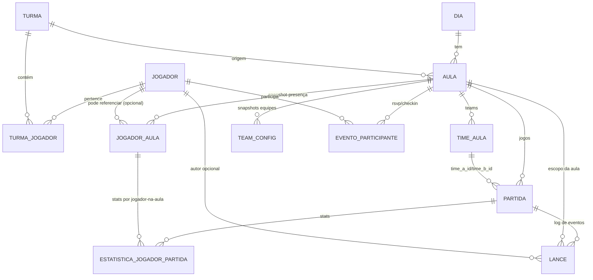

# Relatório de arquitetura e plano de refatoração do Projeto Jubileu

## Executive summary

A base atual do backend do Jubileu (em `backend/jubileu-api-fastapi/app/`) já contém peças importantes que estão **alinhadas com os princípios do “Projeto Jubileu Core”** (separação entre *estado*, *eventos* e *snapshot*, e read-model orientado à UI). Isso aparece claramente no **WorkspaceAula** (read-model) e no uso de **TeamConfig** como versionamento de snapshot de equipes, além do endpoint de “lances” que já se parece com um log append-only. fileciteturn23file0L1-L1 fileciteturn22file0L1-L1 fileciteturn16file0L1-L1 fileciteturn10file0L1-L1 fileciteturn50file19L1-L1 fileciteturn50file18L1-L1

O maior gargalo “de saúde” hoje não é a inexistência de “services” (há `app/services/*`), e sim:

1) **Coesão e modularização**: regras e escrituras de domínio estão espalhadas em routers grandes (principalmente `routers/dias.py` e `routers/partidas.py`) e em um “mega-modelo” (`models/dia_aula.py`) com muitas entidades não coesas no mesmo arquivo. fileciteturn12file0L1-L1 fileciteturn14file0L1-L1 fileciteturn16file0L1-L1

2) **Configuração e sessão de banco**: existe um `app/database.py` que carrega `.env` com `python-dotenv`, cria `engine` e `SessionLocal`, e é consumido por `deps.py`. Funciona, mas dificulta padronizar *settings*, *logging*, *CORS*, *auth* e deploy. fileciteturn29file0L1-L1 fileciteturn28file0L1-L1

3) **Migrations possivelmente incompletas/desalinhadas**: a migration `0001_jubileu_v2_base.py` não reflete várias estruturas presentes nos modelos atuais (por exemplo, tipos/campos e entidades que o código já usa). Isso é risco operacional alto porque “rodar do zero” pode quebrar. fileciteturn49file0L1-L1 fileciteturn16file0L1-L1

4) **Versionamento de release**: no entity["organization","GitHub","code hosting platform"] não há releases publicados para o repositório (no momento do acesso). Isso impede um fluxo “profissional” de deploy/rastreabilidade via tags + changelog. citeturn3view0

A recomendação é uma refatoração **incremental** e compatível com os princípios CORE: criar uma estrutura `app/core`, `app/db` e `app/modules` (ou `app/domains`) que **não muda o comportamento** no primeiro ciclo (apenas move código e cria camadas), e em ciclos seguintes ataca migrações, padronização de rotas (`/api`), e autenticação JWT. O ponto-chave: **o “Core” do Jubileu (decisões conceituais)** não é a mesma coisa que a pasta `app/core` (infra transversal). A documentação precisa deixar isso explícito para não gerar ambiguidade. fileciteturn54file0L1-L1 fileciteturn50file19L1-L1

## Evidências, arquivos inspecionados e suposições

### Escopo e branch analisada

A análise de código foi feita sobre o repositório `FelipeDalMolin/projeto-jubileu` na branch `jubileu-v2` (default configurado no conector). fileciteturn2file0L1-L1

### Arquivos inspecionados

Backend (principais):

- `backend/jubileu-api-fastapi/app/main.py` fileciteturn9file0L1-L1  
- `backend/jubileu-api-fastapi/app/database.py`, `app/deps.py`, `app/deps_auth.py` fileciteturn29file0L1-L1 fileciteturn28file0L1-L1 fileciteturn30file0L1-L1  
- Routers: `app/routers/{dias.py,partidas.py,jogadores.py,turmas.py,eventos.py}` fileciteturn12file0L1-L1 fileciteturn14file0L1-L1 fileciteturn11file0L1-L1 fileciteturn13file0L1-L1 fileciteturn10file0L1-L1  
- Modelos: `app/models/dia_aula.py`, `app/models/jogador_turma.py`, `app/models/__init__.py` fileciteturn16file0L1-L1 fileciteturn17file0L1-L1 fileciteturn43file0L1-L1  
- Schemas: `app/schemas/{dia_aula.py,eventos.py,workspace.py}` fileciteturn19file0L1-L1 fileciteturn18file0L1-L1 fileciteturn51file0L1-L1  
- Services: `app/services/{estado_equipes.py,workspace_aula.py}` fileciteturn22file0L1-L1 fileciteturn23file0L1-L1  
- Dashboards: `app/api/dashboards/*` + `app/services/dashboards/*` fileciteturn24file0L1-L1 fileciteturn25file0L1-L1  

Migrações e setup:

- `backend/jubileu-api-fastapi/alembic/env.py`, `alembic.ini`, `alembic/versions/0001_jubileu_v2_base.py` fileciteturn42file0L1-L1 fileciteturn41file0L1-L1 fileciteturn49file0L1-L1  
- `.env.example`, `requirements.txt`, `docker-compose.yml` fileciteturn38file0L1-L1 fileciteturn39file0L1-L1 fileciteturn34file0L1-L1  
- Scripts: `scripts/setup_backend_structure.ps1`, `setup_backend.ps1`, etc. fileciteturn54file0L1-L1 fileciteturn37file0L1-L1 fileciteturn36file0L1-L1 fileciteturn35file0L1-L1  

Frontend (mínimo para deploy):

- `frontend/jubileu-web/package.json` fileciteturn52file0L1-L1  

Documentos:

- `README.md`, `docs/SETUP_DEV_WINDOWS.md` fileciteturn3file0L1-L1 fileciteturn4file0L1-L1  

Conector Linear (decisões CORE e issues DEV relevantes):

- CORE-1, CORE-2, CORE-3, CORE-4, CORE-5, CORE-6 e DEV-5, DEV-10, DEV-11, DEV-13, DEV-14, DEV-15 etc. fileciteturn50file19L1-L1 fileciteturn50file18L1-L1 fileciteturn50file17L1-L1 fileciteturn50file16L1-L1 fileciteturn50file12L1-L1 fileciteturn50file7L1-L1

### Suposições e limitações

- Não há releases publicados no repositório no GitHub (confirmado via página do repo). citeturn3view0  
- Não foi possível confirmar via web a lista de tags do repo por limitações do crawler (portanto, **tags existentes/não existentes** não foram assertadas; apenas “releases” foi confirmado).  
- Há indícios fortes de **desalinhamento entre schema real e modelos**, porque a migration base não cria várias entidades/campos que aparecem no código atual. A recomendação inclui um passo explícito para “fechar” essa lacuna com migrações novas e/ou `alembic stamp` + migração corretiva (detalhado no plano). fileciteturn49file0L1-L1 fileciteturn16file0L1-L1

## Modelo de domínio atual e pontos de confusão

### Visão conceitual alinhada ao Jubileu Core

As decisões CORE definem explicitamente:

- **Estado**: fotografia consolidada e versionada (para a UI).  
- **Evento**: histórico append-only.  
- **Snapshot**: materialização do estado em um ponto no tempo. fileciteturn50file18L1-L1 fileciteturn50file19L1-L1

No código, isso aparece como:

- `WorkspaceAulaOut` e `build_workspace_aula()` como **read-model** (monta meta/header/kpis/equipes/partidas/warnings). fileciteturn51file0L1-L1 fileciteturn23file0L1-L1  
- `TeamConfig` + `create_team_config()` / `rebuild_estado_equipes()` como **snapshot versionado** de equipes (com `version` incremental e `is_active`). fileciteturn22file0L1-L1  
- `Lance` + endpoints em `routers/eventos.py` sugerindo **event log** (append mostrado via `created_at`, `client_event_id`, etc.). fileciteturn18file0L1-L1 fileciteturn10file0L1-L1 fileciteturn16file0L1-L1  

### Entidades e relacionamentos atuais (ERD em Mermaid)



Fontes do modelo (classes SQLAlchemy/mapeamentos e schemas): fileciteturn16file0L1-L1 fileciteturn17file0L1-L1 fileciteturn19file0L1-L1 fileciteturn18file0L1-L1

### Esclarecendo as entidades que geraram dúvida

#### JogadorAula

Nos schemas, fica explícito que **JogadorAula não é o Jogador global**, mas sim um **snapshot do “jogador dentro da aula”** (com status e vínculo a time dentro da aula). Isso aparece tanto na ideia do `PresencaJogadorDiaOut` (“snapshot do jogador dentro da aula”) quanto em `JogadorAulaOut`. fileciteturn19file0L1-L1

Por que isso existe?

- Permite registrar presenças/ausências e stats da sessão sem “sujar” o `Jogador` global.
- Permite que uma mesma pessoa (Jogador global) tenha múltiplas presenças históricas, uma por aula/dia.
- Também permite casos em que `JogadorAula.jogador_id` seja `NULL` (ex.: convidado, registro manual, ou legado). fileciteturn16file0L1-L1

#### EventoParticipante

Hoje, “EventoParticipante” parece cumprir o papel de **participação operacional no evento (RSVP / check-in / check-out)**, separado do snapshot de presença usado no Workspace.

Exemplos no router `eventos.py`:

- `POST /api/eventos/{evento_id}/rsvp` (`rsvp_self`)
- `POST /api/eventos/{evento_id}/checkin` (`checkin_self`)
- `POST /api/eventos/{evento_id}/checkout` etc. fileciteturn10file0L1-L1

E no schema `EventoParticipanteOut` aparecem campos típicos desse fluxo (status, timestamps, arrival_seq). fileciteturn18file0L1-L1

**Interpretação de domínio**:  
- `JogadorAula` = presença/participação no contexto do planejamento de aula e times/partidas.  
- `EventoParticipante` = presença física/operacional no evento (confirmou? chegou em qual ordem? fez check-in?), útil para “Jogo Livre” com fila/ordem e para geração de partidas automaticamente.

Isso sugere que você está caminhando para um domínio “Evento (Aula/Jogo Livre)”, mas ainda existe uma duplicidade semântica: *presença* aparece em dois lugares (status em `JogadorAula` e status em `EventoParticipante`). Isso é ok no curto prazo, mas no longo prazo convém definir “fonte da verdade” (ex.: `EventoParticipante` governa o check-in e alimenta um snapshot em `JogadorAula`, ou vice-versa).

#### ParticipacaoEvento (inexistente como nome, mas existe como conceito)

Você citou “ParticipacaoEvento”. No código, o nome concreto é `EventoParticipante`. fileciteturn16file0L1-L1 fileciteturn18file0L1-L1

Um bom passo de refatoração é padronizar o vocabulário:

- Persistência: `evento_participantes` (tabela) / `EventoParticipante` (modelo)
- Domínio (docs): “Participação no Evento”
- API: `/api/eventos/{id}/participantes` etc. (já existe listagem). fileciteturn10file0L1-L1

### Onde o domínio atual conflita com a estrutura “ideal”

1) O arquivo `models/dia_aula.py` concentra muitas classes diferentes (Dia, Aula, TimeAula, JogadorAula, Partida, EstatisticaJogadorPartida, EventoParticipante, Lance, enums). Isso reduz coesão e aumenta acoplamento. fileciteturn16file0L1-L1

2) Os routers, especialmente `dias.py`, misturam: validação HTTP, queries SQLAlchemy, regras de negócio (ex.: versionamento, rebuild de snapshots, regras de status), e até montagem de payloads. fileciteturn12file0L1-L1 fileciteturn14file0L1-L1

3) O “Core” do Jubileu (decisões CORE-1/2/3) pede rastreabilidade e separação entre decisões e execução. Hoje, há documentação conceitual no Linear, mas falta consolidar isso em docs no repositório (README aponta `docs/ARCHITECTURE.md` e `docs/DOMAIN_MODEL.md`, mas esses arquivos não existem). fileciteturn3file0L1-L1 fileciteturn50file19L1-L1

## Comparativo de estrutura atual vs estrutura-alvo e impacto

A seguir, uma proposta que respeita:

- Princípios CORE (read-model, evento vs estado vs snapshot). fileciteturn50file19L1-L1 fileciteturn50file18L1-L1  
- A intenção do script `setup_backend_structure.ps1` (core/db/modules), porém ajustada para a realidade do código atual. fileciteturn54file0L1-L1  
- O fato de já existir `app/services/*` e `app/api/dashboards/*` (portanto, não é “começar do zero”, é reorganizar). fileciteturn23file0L1-L1 fileciteturn24file0L1-L1

### Tabela comparativa

| Estrutura atual (exemplos reais) | Estrutura-alvo proposta (modules/core/db) | Impacto na refatoração (risco, esforço, testes/migrations, compat) |
|---|---|---|
| `app/main.py` cria `FastAPI()` e registra routers diretamente, incluindo dashboards. fileciteturn9file0L1-L1 | `app/main.py` vira “composition root”: `create_app()` + inclusão de routers por módulo; configs e middlewares em `core/`. | **Risco baixo** (mudança mecânica). **Esforço**: pequeno/médio. **Testes**: smoke test de rotas. **Compat**: total (mesmas rotas). |
| `app/database.py` carrega `.env` via `dotenv`, valida `DATABASE_URL`, cria `engine`, `SessionLocal`, `Base`. fileciteturn29file0L1-L1 | `app/core/config.py` (Pydantic Settings) centraliza env; `app/db/session.py` cria engine/session; `app/db/base.py` mantém import de modelos. | **Risco baixo/médio** (se mexer em import order). **Esforço**: médio. **Testes**: startup + DB connect test. **Compat**: total se `DATABASE_URL` mantido. Fontes: Pydantic Settings citeturn22search0 e SQLAlchemy session lifecycle citeturn22search4. |
| `app/models/dia_aula.py` contém muitas entidades. fileciteturn16file0L1-L1 | `app/modules/aulas/models.py`, `modules/partidas/models.py`, `modules/eventos/models.py` etc; cada módulo exporta seus modelos; `db/base.py` importa todos. | **Risco médio** (alembic autogenerate depende de import). **Esforço**: médio/alto. **Testes**: migrations autogenerate sanity + queries principais. **Compat**: total (mesmas tabelas). Alembic autogenerate requer `target_metadata` com modelos importados citeturn23search0. |
| Routers grandes (`routers/dias.py`, `routers/partidas.py`) com regras e queries acopladas. fileciteturn12file0L1-L1 | `modules/dias/routes.py` só HTTP; `modules/dias/service.py` regras; `modules/dias/repo.py` (opcional) para queries. | **Risco baixo/médio**. **Esforço**: alto (mas incremental). **Testes**: unit tests de services + integration tests de endpoints. **Compat**: manter payloads do front (Workspace DTO). CORE-3/DEV-5 reforçam read-model estável. fileciteturn50file17L1-L1 fileciteturn50file15L1-L1 |
| `deps_auth.py` usa headers `X-User-Id`, `X-Role`, `X-Jogador-Id` (auth “mock”). fileciteturn30file0L1-L1 | `modules/auth` com `users` + JWT, `OAuth2PasswordBearer` e hashing de senha; headers viram compatibilidade temporária (feature flag). | **Risco médio** (mudança de contrato). **Esforço**: médio/alto. **Testes**: auth flow + RBAC tests. **Compat**: fornecer modo “legacy headers” por um ciclo. FastAPI security docs existem (OAuth2 + JWT). citeturn26view0 |
| `routers/eventos.py` está em `/api/*`, mas outros routers não; API base inconsistente. fileciteturn10file0L1-L1 fileciteturn11file0L1-L1 | Padronizar `/api` para tudo (com redirect/alias temporário). | **Risco médio** (front). **Esforço**: médio. **Testes**: contract tests. **Compat**: manter antigas rotas por um ciclo com `include_router` duplicado ou redirects 307. |
| Alembic: existe `env.py` apontando `Base.metadata` e importando `app.models`. fileciteturn42file0L1-L1 | Manter o padrão, mas garantir que `db/base.py` importa todos os módulos; migrations corretivas para divergências. | **Risco alto** se DB real divergir. **Esforço**: alto dependendo do estado do DB. **Testes**: migration tests em DB limpo + staging. Operações de rename/alter são suportadas. citeturn25search0 |
| Não há releases no GitHub (“No releases published”). citeturn3view0 | Introduzir SemVer + tags + release notes + `RELEASES.md`. | **Risco baixo** (processual). **Esforço**: pequeno. **Testes**: checklist de release. Fonte: docs GitHub releases. citeturn2search3 |

## Plano de execução priorizado

O plano está organizado em fases, para manter o projeto sempre “rodando” e reduzir risco (princípio de evolução incremental do CORE-1). fileciteturn50file19L1-L1

### Fase de estabilização e inventário

Objetivo: garantir que sabemos “o que existe” e reduzir risco de quebrar ambiente.

Tarefas:

- Criar `docs/DOMAIN_MODEL.md` e `docs/ARCHITECTURE.md` (faltam hoje, apesar do README sugerir). fileciteturn3file0L1-L1  
- Escrever um script de smoke test (pytest) que:
  - sobe app (`TestClient`)
  - verifica `/health` (adicionar endpoint)
  - lista rotas essenciais (dias/aulas/turmas/jogadores/eventos/workspace/dashboards).  
- Validar a trabalhabilidade do Alembic:
  - Rodar `alembic upgrade head` em um banco vazio e rodar o backend, verificando se tabelas usadas pelo código existem.
  - Se falhar (provável, dado o gap entre migration e modelos), escolher uma estratégia:  
    - **Estratégia A (mais segura)**: criar nova migration corretiva (sem apagar a base).  
    - **Estratégia B (se DB de produção não existe)**: “reset” das migrations e recriar baseline consistente (somente se não há dados reais).  
  Evidência do baseline atual: `0001_jubileu_v2_base.py`. fileciteturn49file0L1-L1  

Git workflow:

- Branch: `chore/stabilize-tests-and-docs`
- PR checklist:
  - [ ] app sobe com `uvicorn app.main:app` (como docs sugerem) fileciteturn4file0L1-L1  
  - [ ] `pytest` passa
  - [ ] docs geradas

### Fase de modularização sem alterar comportamento

Objetivo: reorganizar em `core/db/modules` sem mudar o contrato.

Tarefas (ordem recomendada):

1) Criar `app/core/config.py` usando `pydantic-settings` (já está no `requirements.txt` como dependência recomendada). fileciteturn39file0L1-L1 citeturn22search0  
2) Criar `app/db/session.py` e `app/db/base.py`.  
   - `base.py` deve importar os modelos (ou módulos) para garantir `Base.metadata` completo (ponto crítico para Alembic autogenerate). fileciteturn42file0L1-L1 citeturn23search0  
3) Ajustar `app/deps.py` para usar `SessionLocal` de `db/session.py`. Padrão de “lifecycle externo” do SQLAlchemy é recomendado (gerenciar sessão fora da lógica). fileciteturn28file0L1-L1 citeturn22search4  
4) Refatorar `main.py` para `create_app()` + inclusão de routers agrupados.
5) Migrar aos poucos serviços existentes para `modules/*/service.py`, começando por:
   - `modules/aulas` (Workspace e estado)
   - `modules/eventos` (RSVP/check-in/lances)
   - `modules/dashboards` (já é “quase módulo”)

Git workflow:

- Branch: `refactor/modularize-app-shell`
- Tags (internas, sem release ainda): `v0.2.0-dev.1` (apenas tag anotada) — se adotarem SemVer.

### Fase de reorganização por domínio e redução do “mega-modelo”

Objetivo: aumentar coesão e diminuir acoplamento.

Tarefas:

- Quebrar `models/dia_aula.py` em múltiplos arquivos por domínio:
  - `modules/dias/models.py` → `Dia`
  - `modules/aulas/models.py` → `Aula`, `JogadorAula`, `TimeAula`, `TeamConfig`
  - `modules/partidas/models.py` → `Partida`, `EstatisticaJogadorPartida`
  - `modules/eventos/models.py` → `EventoParticipante`, `Lance`
- Criar “barrel imports” em `db/base.py` e remover `app/models/__init__.py` como “registrador global” (ou manter, mas apontando para `db/base.py`). Hoje `app/models/__init__.py` já cumpre esse papel para Alembic. fileciteturn43file0L1-L1  

Testes:

- Unit tests de service (sem FastAPI).
- Integration tests com `TestClient` (endpoints).
- Migration tests: subir DB limpo, aplicar migrations, rodar queries básicas.

### Fase de rotas `/api`, compatibilidade e contrato

Objetivo: padronizar e preparar NGINX/Front.

Tarefas:

- Definir API base:
  - opção recomendada: tudo sob `/api`, e manter rotas antigas por 1 release (redirect 307 ou alias).
- Documentar em `API.md` o contrato do Workspace e endpoints principais (CORE-3). fileciteturn50file17L1-L1  
- Ajustar front gradualmente se necessário (DEV-6/DEV-15 mostram histórico de mudanças no consumo do Workspace). fileciteturn50file14L1-L1 fileciteturn50file4L1-L1

### Fase de autenticação definitiva e RBAC

Objetivo: substituir `deps_auth.py` (headers) por JWT, mantendo modo legacy temporário.

Tarefas:

- Criar `modules/auth`:
  - `models.py`: `User` (e possivelmente `UserSession`/refresh tokens).
  - `service.py`: `hash_password`, `verify_password`, `create_access_token`, `decode_token`.
  - `routes.py`: `/api/auth/login`, `/api/auth/me`, `/api/auth/register` (ou convite).
- Migrar endpoints sensíveis para `Depends(get_current_user)` e `require_roles`.
- Manter compatibilidade: por um tempo, permitir “auth por header” se `settings.AUTH_MODE=legacy`.

### Alembic: passos concretos para rename de tabelas/colunas

Se a mudança “significativa no domínio” incluir renomear camada de persistência (por exemplo, `aulas` → `eventos`), use migrações explícitas com `op.rename_table()` e `op.alter_column(new_column_name=...)`. citeturn25search0

Sequência recomendada (PostgreSQL):

1) `alembic revision -m "rename aulas to eventos"`  
2) Na migration:
   - `op.rename_table("aulas", "eventos")`
   - `op.alter_column("jogadores_aula", "aula_id", new_column_name="evento_id")`
   - atualizar FKs/constraints conforme necessário
3) Atualizar modelos para refletir novos nomes
4) Rodar `alembic upgrade head` em staging
5) Validar que o read-model (Workspace) continua igual (contrato com front)

**Nota**: renames são manuais; autogenerate não detecta renome com segurança (tende a propor drop+add). Por isso o passo manual é obrigatório. Base conceitual de operações de rename: Alembic Operations API. citeturn25search0

## Snippets de código recomendados

Os exemplos abaixo focam no “esqueleto” modular e em boas práticas de config/sessão, preservando a stack atual (FastAPI + SQLAlchemy 2 + Pydantic v2).

### `app/main.py` (composition root + factory)

```python
# app/main.py
from fastapi import FastAPI
from fastapi.middleware.cors import CORSMiddleware

from app.core.config import settings
from app.modules import api_router  # agregador de routers

def create_app() -> FastAPI:
    app = FastAPI(
        title=settings.PROJECT_NAME,
        version=settings.APP_VERSION,
        openapi_url=f"{settings.API_PREFIX}/openapi.json",
        docs_url=f"{settings.API_PREFIX}/docs",
        redoc_url=f"{settings.API_PREFIX}/redoc",
    )

    # CORS (configure estritamente em produção)
    if settings.CORS_ORIGINS:
        app.add_middleware(
            CORSMiddleware,
            allow_origins=settings.CORS_ORIGINS,
            allow_credentials=True,
            allow_methods=["*"],
            allow_headers=["*"],
        )

    app.include_router(api_router, prefix=settings.API_PREFIX)

    @app.get("/health")
    def health():
        return {"status": "ok"}

    return app

app = create_app()
```

Referência do middleware CORS e parâmetros: FastAPI `CORSMiddleware` na documentação oficial. citeturn26view0

### `app/core/config.py` (Pydantic Settings)

```python
# app/core/config.py
from pydantic_settings import BaseSettings, SettingsConfigDict
from pydantic import Field
from typing import List

class Settings(BaseSettings):
    model_config = SettingsConfigDict(
        env_file=".env",
        extra="ignore",
    )

    PROJECT_NAME: str = "Jubileu API"
    APP_VERSION: str = "0.2.0-dev"
    API_PREFIX: str = "/api"

    DATABASE_URL: str = Field(..., description="postgresql+psycopg://...")

    # Segurança / Auth
    JWT_SECRET: str = Field(..., min_length=32)
    JWT_ALGORITHM: str = "HS256"
    ACCESS_TOKEN_EXPIRE_MINUTES: int = 60

    # Deploy
    CORS_ORIGINS: List[str] = []

settings = Settings()
```

Pydantic Settings `BaseSettings` e `env_file`: documentação oficial do Pydantic. citeturn22search0

### `app/db/session.py` e `app/db/base.py`

```python
# app/db/session.py
from sqlalchemy import create_engine
from sqlalchemy.orm import sessionmaker

from app.core.config import settings

engine = create_engine(
    settings.DATABASE_URL,
    pool_pre_ping=True,  # evita conexões mortas
    future=True,
)

SessionLocal = sessionmaker(
    bind=engine,
    autocommit=False,
    autoflush=False,
    future=True,
)
```

`pool_pre_ping` é uma prática recomendada na docs do SQLAlchemy (connection pooling). citeturn22search6

```python
# app/db/base.py
from sqlalchemy.orm import declarative_base

Base = declarative_base()

# IMPORTANTE: importar módulos de models para registrar no metadata
from app.modules.aulas import models as aulas_models  # noqa
from app.modules.dias import models as dias_models  # noqa
from app.modules.jogadores import models as jogadores_models  # noqa
from app.modules.eventos import models as eventos_models  # noqa
from app.modules.partidas import models as partidas_models  # noqa
```

O ponto-chave aqui é garantir que `target_metadata` do Alembic veja todas as tabelas (importar modelos). citeturn23search0

### `app/deps.py` (get_db)

```python
# app/deps.py
from typing import Generator
from sqlalchemy.orm import Session
from app.db.session import SessionLocal

def get_db() -> Generator[Session, None, None]:
    db = SessionLocal()
    try:
        yield db
    finally:
        db.close()
```

Isso é equivalente ao estilo atual (`deps.py` já existe), apenas movendo a origem do `SessionLocal`. fileciteturn28file0L1-L1

### Exemplo de módulo: `app/modules/eventos/`

Estrutura sugerida:

```
app/modules/eventos/
  __init__.py
  models.py
  schemas.py
  service.py
  routes.py
```

`routes.py` (exemplo simplificado):

```python
# app/modules/eventos/routes.py
from fastapi import APIRouter, Depends
from sqlalchemy.orm import Session

from app.deps import get_db
from app.modules.auth.deps import get_current_user  # JWT
from app.modules.eventos import schemas, service

router = APIRouter(prefix="/eventos", tags=["Eventos"])

@router.post("/{evento_id}/checkin", response_model=schemas.EventoParticipanteOut)
def checkin_self(
    evento_id: int,
    db: Session = Depends(get_db),
    user = Depends(get_current_user),
):
    return service.checkin_self(db=db, evento_id=evento_id, jogador_id=user.jogador_id)
```

A lógica real hoje está diretamente no router `app/routers/eventos.py`; o objetivo é mover para `service.py`. fileciteturn10file0L1-L1

## Deploy, segurança e operação

### NGINX: servir React (Vite build) e proxy para FastAPI

O frontend é um projeto Vite/React (`vite build`) e por padrão gera `dist/`. fileciteturn52file0L1-L1

Exemplo de server block NGINX:

```nginx
server {
    listen 80;
    server_name jubileu.example.com;

    # Frontend (Vite build)
    root /var/www/jubileu-web/dist;
    index index.html;

    # SPA routing: qualquer rota desconhecida cai no index.html
    location / {
        try_files $uri $uri/ /index.html;
    }

    # API proxy
    location /api/ {
        proxy_pass http://127.0.0.1:8000/;
        proxy_set_header Host $host;
        proxy_set_header X-Forwarded-For $proxy_add_x_forwarded_for;
        proxy_set_header X-Forwarded-Proto $scheme;
    }
}
```

Base técnica:
- `try_files` na doc do NGINX (core module) citeturn21search3  
- `proxy_pass` e regras de mapeamento na doc oficial do módulo proxy citeturn21search4  
- Guia NGINX reverse proxy (admin guide) citeturn21search6  

Se futuramente houver WebSocket (por MQTT via WebSocket), adicionar headers `Upgrade`/`Connection` conforme doc oficial do NGINX sobre WebSocket proxying. citeturn19search6

### Process manager: systemd unit (Gunicorn/ASGI ou Uvicorn)

**Opção A (recomendada para produção)**: Gunicorn com worker ASGI nativo (menos dependência de worker externo). citeturn19search5  
**Opção B**: Uvicorn multiprocess (`--workers`) ou Gunicorn + uvicorn-worker (atenção ao aviso de depreciação em algumas docs do Uvicorn). citeturn19search0

Exemplo com Gunicorn ASGI (`/etc/systemd/system/jubileu-api.service`):

```ini
[Unit]
Description=Jubileu API (FastAPI)
After=network.target

[Service]
User=www-data
Group=www-data
WorkingDirectory=/opt/projeto-jubileu/backend/jubileu-api-fastapi
EnvironmentFile=/opt/projeto-jubileu/backend/jubileu-api-fastapi/.env
ExecStart=/opt/projeto-jubileu/backend/jubileu-api-fastapi/.venv/bin/gunicorn \
  app.main:app \
  --worker-class asgi \
  --workers 4 \
  --bind 127.0.0.1:8000 \
  --access-logfile - \
  --error-logfile -

Restart=on-failure
RestartSec=5

[Install]
WantedBy=multi-user.target
```

Referências:
- `Restart=on-failure` e comportamento de service restart: systemd docs. citeturn20search8  
- Conceitos de unit file e seções `ExecStart`, `WorkingDirectory`, etc: Red Hat docs (boa explicação estruturada). citeturn20search4  

### HTTPS com Certbot

- Certbot é recomendado pela Let’s Encrypt como cliente ACME. citeturn20search6  
- O fluxo “certbot + nginx” é documentado e amplamente usado; para instruções específicas, usar o gerador oficial do Certbot. citeturn21search1  

Checklist de hosting (alto nível):

- [ ] `DEBUG` desligado (se existir), logs estruturados
- [ ] CORS restrito ao domínio do front (não `*` em produção), conforme parâmetros oficiais do CORSMiddleware. citeturn26view0  
- [ ] `X-Forwarded-*` corretamente setado e app confiando apenas no proxy local (Uvicorn tem seção específica de forwarded headers). citeturn19search0  
- [ ] Secrets fora do Git (usar `.env` e permissões de arquivo)
- [ ] Backup de Postgres e migrações testadas

## Auth, versionamento de releases e documentação

### Arquitetura de usuários/autenticação recomendada

Hoje existe um auth “de cabeçalho” (`X-User-Id`, `X-Role`, `X-Jogador-Id`). Isso é útil como *stub* local, mas não é adequado para produção. fileciteturn30file0L1-L1

Recomendação:

- `users` (autenticação) ≠ `jogadores` (domínio do futebol)
- Um `User` pode (opcionalmente) estar ligado a um `Jogador` (`user.jogador_id`) para habilitar “ações do jogador” (ex.: check-in self).
- Roles: `admin`, `treinador`, `auxiliar`, `user` (vocabulário já existe no stub). fileciteturn30file0L1-L1

Fluxo JWT (resumo):

```mermaid
flowchart LR
  A[POST /api/auth/login] --> B[verifica senha + role]
  B --> C[gera JWT access token]
  C --> D[Front armazena token]
  D --> E[Requests com Authorization: Bearer]
  E --> F[Depends(get_current_user)]
  F --> G[RBAC / require_roles]
```

FastAPI possui documentação de middleware e segurança (inclui OAuth2/JWT) na doc oficial. citeturn26view0

Endpoints mínimos:

- `POST /api/auth/login` → retorna `{access_token, token_type}`
- `GET /api/auth/me` → retorna profile + role + jogador_id
- (Opcional) `POST /api/auth/register` ou convite/admin-only

Hash de senha:

- Adicionar dependência: `passlib[bcrypt]` (ou `bcrypt`).
- Nunca armazenar senha em texto puro.

### Releases, versionamento e tags

Situação atual:

- No GitHub, **não há releases publicados** para o repositório neste momento. citeturn3view0

Proposta de modelo “profissional”:

- SemVer: `vMAJOR.MINOR.PATCH` + sufixos `-alpha.N`, `-beta.N`, `-rc.N`.
- Tags anotadas e PRs com checklist.
- `RELEASES.md` com changelog por versão.

Referência oficial de como GitHub entende e gerencia releases: documentação “Managing releases”. citeturn2search3

### O que documentar e templates sugeridos

Criar (na pasta `docs/`):

1) `DOMAIN_MODEL.md`  
   - vocabulário (“Aula” vs “Evento”), fonte da verdade para presença, relação entre `TeamConfig`/`Lance`/`WorkspaceAula`.
2) `ARCHITECTURE.md`  
   - princípios CORE-1 (rastreabilidade), e como o código implementa (módulos, read-model, eventos). fileciteturn50file19L1-L1  
3) `API.md`  
   - contrato do Workspace DTO (CORE-3/DEV-5) e rotas (/api). fileciteturn50file17L1-L1 fileciteturn50file15L1-L1  
4) `RELEASES.md`  
   - changelog e política de compatibilidade.

### TODO priorizado com donos, estimativas e critérios de aceite

| Prioridade | TODO | Dono (papel) | Tamanho | Aceite |
|---|---|---:|---:|---|
| P0 | Criar docs `DOMAIN_MODEL.md` + `ARCHITECTURE.md` com decisões CORE incorporadas | Tech Lead | M | Docs referenciam CORE-1/2/3; descrevem entidades atuais e regras de estado/evento/snapshot |
| P0 | Testes smoke + CI local (`pytest`) | Backend | M | `pytest` valida startup, DB connection, endpoints críticos |
| P0 | Fechar gap de migrations vs modelos (migração corretiva ou reset controlado) | Backend | G | DB “zerado” sobe e app roda sem erro; staging aplica migrations com sucesso |
| P1 | Introduzir `core/config.py` + `db/session.py` + `db/base.py` sem mudar comportamento | Backend | M | Rotas e respostas iguais; `DATABASE_URL` centralizado |
| P1 | Modularizar routers: mover lógica para `modules/*/service.py` | Backend | G | Routers finos; services unit-testáveis; read-model preservado |
| P1 | Padronizar `/api` com compat temporária | Fullstack | M | Front funciona; rotas antigas mantidas por 1 versão |
| P2 | Implementar auth JWT + RBAC, com “legacy headers mode” temporário | Backend | G | Login retorna JWT; endpoints protegidos; modo antigo disponível por flag |
| P2 | Deploy Linux: NGINX + systemd + HTTPS (Certbot) + checklist | DevOps | M | App estável, logs, restart on-failure, HTTPS ok |

## Referências prioritárias

- Repositório e código do projeto (arquivos citados acima via conector GitHub). fileciteturn9file0L1-L1 fileciteturn16file0L1-L1  
- Decisões e princípios no Linear (CORE-1/2/3/4/5/6) e issues DEV relacionadas. fileciteturn50file19L1-L1 fileciteturn50file18L1-L1 fileciteturn50file17L1-L1  
- FastAPI middleware/CORS (doc oficial). citeturn26view0  
- SQLAlchemy 2.0 Session basics e pooling (`pool_pre_ping`). citeturn22search4 citeturn22search6  
- Alembic autogenerate e Operations API (rename_table etc). citeturn23search0 citeturn25search0  
- NGINX docs (`try_files`, `proxy_pass`, reverse proxy guide, WebSocket proxying). citeturn21search3 citeturn21search4 citeturn21search6 citeturn19search6  
- Uvicorn deployment e proxies/forwarded headers. citeturn19search0  
- Gunicorn ASGI worker e guia de deploy. citeturn19search5 citeturn19search3  
- systemd.service e documentação Red Hat de unit files. citeturn20search8 citeturn20search4  
- Let’s Encrypt (recomendação do Certbot) e gerador oficial do Certbot. citeturn20search6 citeturn21search1